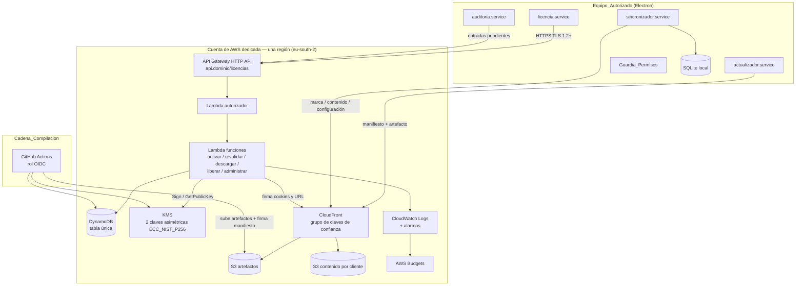
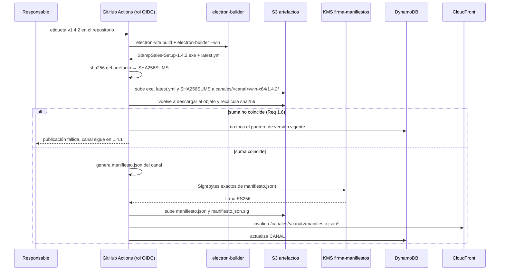
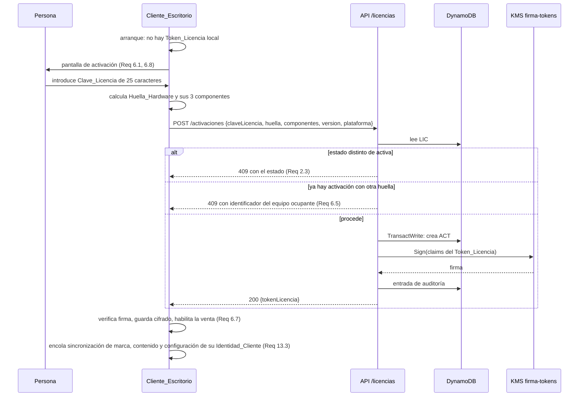
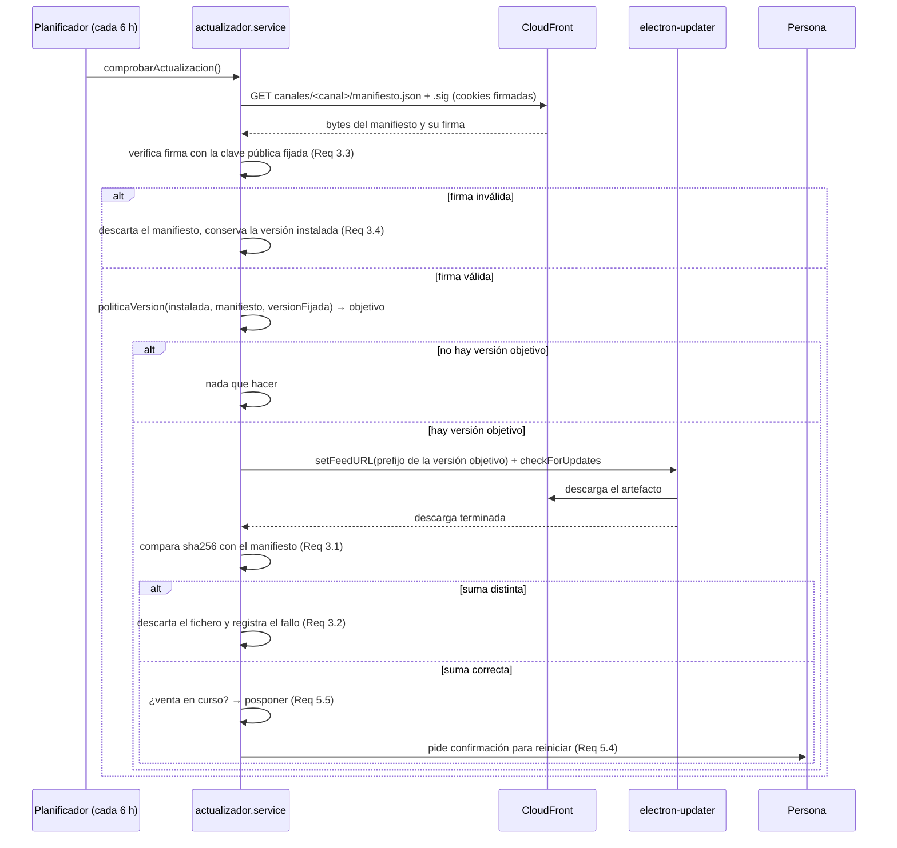
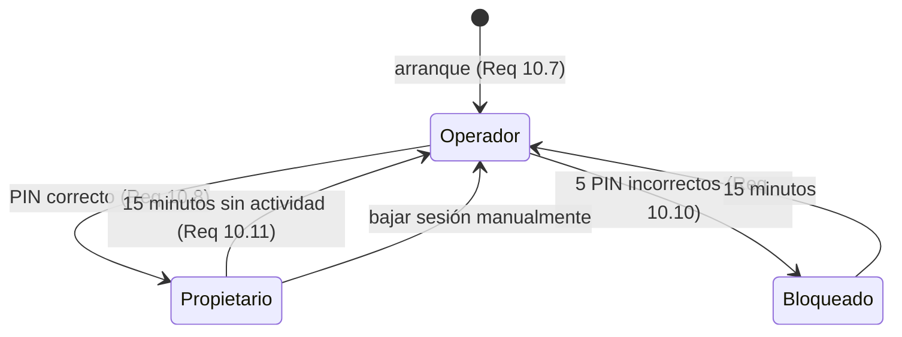

# Documento de Diseño: Distribución y licenciamiento en AWS

## Visión general

Este documento describe la arquitectura objetivo de distribución, actualización, licenciamiento y control de acceso del Cliente_Escritorio (Electron + SQLite), apoyada en AWS, y resuelve las decisiones técnicas que quedaron abiertas al cerrar los requisitos: selección concreta de servicios, modelo de datos del Servicio_Licencias, formato de los documentos firmados, disposición de los objetos en S3, derivación de la Huella_Hardware, ubicación de los módulos nuevos dentro del proceso principal, modelo de roles y elevación, cadena de publicación y plan por fases.

### Qué se entrega ahora y qué queda diferido

La entrega de esta especificación es **documental**. El comportamiento actual de la aplicación no cambia.

| Se produce en esta entrega | Queda diferido a fases de implementación |
| --- | --- |
| El Documento_Arquitectura en `docs/distribucion-aws.md`, en español, con los flujos, procedimientos operativos, tabla de diagnóstico, estimación de costes y comparación de modalidades de entrega (Requisito 19) | Toda la infraestructura de AWS (Requisitos 1, 2, 17, 18) |
| Las decisiones de diseño de este documento, con su justificación y las alternativas descartadas | El Servicio_Licencias, la activación, la revalidación y la revocación (Requisitos 6, 7, 9) |
| Opcionalmente, los módulos **puros y autocontenidos** de análisis y serialización de documentos (`Analizador_Token`, `Serializador_Token`, analizador de Manifiesto_Actualizacion, analizador de índice de Paquete_Contenido y de Configuracion_Remota) más el cálculo de Huella_Hardware, el cálculo de Periodo_Gracia_Offline y el Guardia_Permisos, con sus pruebas basadas en propiedades | El Actualizador_Cliente, el Sincronizador_Remoto, la pantalla de activación, la sesión con roles y el Registro_Auditoria (Requisitos 3, 5, 10, 11, 12, 13, 16) |

Los módulos opcionales se admiten en esta entrega porque son funciones puras: no tocan la red, no tocan SQLite, no se registran en el arranque y nadie los invoca desde el flujo de venta. Su valor es que fijan los formatos de los documentos antes de construir la infraestructura y dejan las propiedades del Requisito 14 verificadas. Si se implementan, se añaden bajo `src/main/licencia/`, `src/main/actualizacion/`, `src/main/sincronizacion/` y `src/main/permisos/` sin ninguna llamada desde `src/main/index.ts` ni desde `src/main/ipc/handlers.ts`.

### Decisiones estructurales

1. **AWS es origen de publicación, nunca base de datos de consulta.** La venta y la impresión leen exclusivamente de SQLite local. Todo lo que llega de AWS se materializa en SQLite dentro de una transacción antes de usarse.
2. **Un solo artefacto por versión y plataforma.** El Instalador_Neutro no contiene datos de ningún cliente. La personalización llega por Identidad_Cliente después de activar.
3. **Sin credenciales de AWS en el equipo.** El equipo se autentica con su Clave_Licencia y su Huella_Hardware ante una API propia; lo único que recibe es un Token_Licencia firmado y cookies o URL firmadas de CloudFront con caducidad. No se instala el SDK de AWS ni se distribuyen claves IAM.
4. **Todo lo que decide comportamiento va firmado.** Token_Licencia, Manifiesto_Actualizacion y Perfil_Permisos se firman con claves privadas que residen en KMS y nunca salen de AWS.
5. **La red vive fuera del camino crítico.** Licencia, actualización, contenido y auditoría se ejecutan en un planificador de segundo plano con tiempo de espera de 10 segundos, arrancado después de crear la ventana. Ninguna operación de venta espera a la red.
6. **Sin certificado de firma de código hoy.** La verificación SHA-256 y el Manifiesto_Actualizacion firmado son obligatorios desde el primer día; la firma del ejecutable es condicional y se incorpora sin cambiar el resto del diseño.

## Arquitectura

### Componentes de AWS seleccionados



### Justificación de la selección y alternativas descartadas

| Necesidad | Elección | Por qué | Alternativas descartadas |
| --- | --- | --- | --- |
| Almacenar artefactos y contenido | **S3** con cifrado SSE-S3 y reglas de ciclo de vida | Pago por uso, cifrado en reposo sin configuración adicional (Req 1.2), ciclo de vida a Glacier Instant Retrieval a los 180 días (Req 17.3) | EFS o EBS: facturación continua, incompatible con Req 17.1 |
| Entregar artefactos con caducidad y por Identidad_Cliente | **CloudFront** con grupo de claves de confianza, cookies firmadas para prefijos y URL firmada para ficheros concretos | Una sola política firmada cubre un prefijo completo (`/clientes/<id>/*`), lo que hace cumplir 13.8 y 13.9 en el borde sin código; el 403 lo devuelve CloudFront, no una Lambda. La transferencia S3→CloudFront no se factura y la capa gratuita de CloudFront absorbe el tráfico previsto ([precios de CloudFront](https://aws.amazon.com/cloudfront/pricing/)) | URL prefirmadas de S3: firman **un objeto cada vez**, exponen el nombre del bucket y obligan a emitir cientos de firmas para sincronizar un Paquete_Contenido; se descarta por coste operativo, no por precio |
| API de licencias | **API Gateway HTTP API + Lambda** | HTTP API cuesta aproximadamente un tercio que REST API y el volumen previsto (unas 25 000 peticiones al mes) cae dentro de la capa gratuita de Lambda; sin cómputo permanente (Req 17.1) | ECS/App Runner/EC2: facturación continua. Function URL sola: pierde la limitación de tasa y el autorizador reutilizable |
| Estado de licencias | **DynamoDB en modo bajo demanda**, tabla única | Volumen diminuto (unos 150 Equipo_Autorizado), coste dominado por almacenamiento (céntimos), contadores atómicos para la cuota de Enlace_Temporal y TTL nativo para caducar cuotas y auditoría | RDS o Aurora Serverless v2: mínimo facturable muy por encima de 15 EUR |
| Identidad del equipo | **Flujo propio con Clave_Licencia + Huella_Hardware**, respuesta en JWT ES256 | Lo que se autentica es una máquina, no una persona; el Token_Licencia ya debe transportar estado de licencia, Identidad_Cliente y Perfil_Permisos, así que un token propio evita duplicar el modelo. El autorizador de API Gateway verifica ese mismo token | **Cognito**: descartado. Un grupo de usuarios modela personas, exigiría un usuario sintético por equipo y un mapeo paralelo a licencias; un grupo de identidades entregaría credenciales de AWS al equipo, que es justo lo que el Requisito 15 prohíbe |
| Claves de firma | **KMS asimétrico**, dos claves `SIGN_VERIFY` ECC_NIST_P256: `firma-tokens` y `firma-manifiestos` | La clave privada no sale de AWS ni aparece en un repositorio; rotación y registro de uso incluidos; ES256 produce firmas cortas. Dos claves permiten rotar la de manifiestos sin invalidar tokens vivos | Claves en **Secrets Manager**: la clave privada acabaría en memoria de la Lambda y del ejecutor de compilación; se usa Secrets Manager solo si hiciera falta guardar el certificado de firma de código |
| Registro y alertas | **CloudWatch Logs** con retención de 30 días, una alarma métrica para equipos sin revalidar (Req 16.8) y **AWS Budgets** con aviso por correo al 80 % (Req 17.5, 18.4) | Incluido, sin coste apreciable en este volumen | Pilas de observabilidad de terceros: coste fijo |
| Infraestructura como código | **AWS CDK en TypeScript**, en `infra/`, con contexto `entorno` (`pruebas` \| `produccion`) que prefija todos los recursos | Mismo lenguaje y mismas herramientas que el resto del repositorio (Req 18.6, 18.7) | Terraform: añade otra cadena de herramientas al proyecto sin ventaja aquí |
| Región | **eu-south-2 (España)** para producción | Proximidad a los clientes finales (Req 18.5); DynamoDB, Lambda, API Gateway, KMS y Secrets Manager están disponibles allí (verificado). CloudFront es global, y las funciones de la Cadena_Compilacion no dependen de la región | eu-west-1 como alternativa si algún servicio futuro no llega a eu-south-2 |

**Coste mensual estimado** para 150 Equipo_Autorizado y 12 publicaciones al año (Req 17.2, 19.5):

| Servicio | Supuesto | Coste mensual estimado |
| --- | --- | --- |
| S3 estándar | 8 GB de artefactos e imágenes | ~0,20 USD |
| CloudFront | ~20 GB de salida al mes | 0 con la capa gratuita; ~1,70 USD sin ella |
| API Gateway HTTP API | ~25 000 peticiones | ~0,03 USD |
| Lambda | ~50 000 invocaciones de 256 MB y 300 ms | ~0 (capa gratuita) |
| DynamoDB bajo demanda | <1 GB, ~60 000 operaciones | ~0,30 USD |
| KMS | 2 claves asimétricas + ~30 000 firmas | ~2,10 USD |
| CloudWatch Logs | <1 GB ingerido | ~0,50 USD |
| **Total** | | **~3,50 USD (≈3,20 EUR)**, con margen sobre el objetivo de 15 EUR |

El margen es deliberado: absorbe la salida de CloudFront si la capa gratuita deja de aplicarse y el pico de descargas del mes de una publicación.

### Flujo de publicación de una versión



`manifiesto.json` es el documento de control: decide qué versión puede instalar cada canal, respeta la Version_Fijada y transporta la orden de retorno. `latest.yml` se conserva porque es lo que electron-updater consume de forma nativa; el Actualizador_Cliente primero decide la versión objetivo con el manifiesto firmado y solo entonces apunta el proveedor genérico de electron-updater al prefijo de esa versión concreta.

### Flujo de activación de licencia



La activación manual sin red (Req 6.9) usa el mismo documento: la pantalla muestra la Huella_Hardware y sus tres componentes en forma legible, el responsable ejecuta el procedimiento de administración contra la API y devuelve el Token_Licencia por el canal que sea, y la aplicación lo acepta pegado en la misma pantalla. La preinstalación con activación previa a la entrega (Req 6.10) es exactamente este flujo ejecutado por el Rol_Propietario antes de enviar el equipo.

### Flujo de actualización



### Flujo de sincronización de contenido y personalización

```mermaid
sequenceDiagram
    participant S as Planificador (cada 6 h)
    participant SR as sincronizador.service
    participant CF as CloudFront
    participant DB as SQLite

    S->>SR: sincronizar(identidadCliente del Token_Licencia)
    SR->>CF: GET clientes/<id>/contenido/indice.json
    CF-->>SR: índice con nombre, año, feria, tipo, tamaño y sha256
    SR->>DB: lee sumas locales de image_sync
    SR->>SR: planSincronizacion(remoto, local) → solo las imágenes con sha256 distinto (Req 12.6)
    loop cada imagen pendiente
        SR->>CF: GET clientes/<id>/contenido/imagenes/<ruta>
        SR->>SR: verifica sha256 (Req 12.4)
    end
    SR->>DB: BEGIN → escribe imágenes verificadas, marca, configuración → COMMIT (Req 12.14)
    Note over SR,DB: una interrupción deja la base en el estado anterior;<br/>las imágenes con suma incorrecta se descartan y se conserva la local (Req 12.5)
```

La carga desde la carpeta `bbdd-ferias` sigue operativa e independiente (Req 12.10): `syncImages` continúa ejecutándose en el arranque como hoy. El Sincronizador_Remoto escribe en las mismas tablas `images` e `image_sync` reutilizando `buildImageName`, con una columna nueva de origen (`local` \| `remoto`) para que un contenido remoto no borre lo que el cliente puso a mano ni al contrario.

### Cuenta, entornos y despliegue

- Cuenta de AWS nueva y dedicada al negocio, con MFA en el usuario raíz y el raíz sin uso cotidiano (Req 18.1, 18.2, 18.3).
- Un solo despliegue de CDK con dos pilas parametrizadas por el contexto `entorno`: `pruebas` y `produccion`. Los recursos se prefijan (`sellos-dist-pruebas-*`, `sellos-dist-produccion-*`) y los buckets y la tabla son distintos (Req 18.7).
- La Cadena_Compilacion asume un rol mediante OIDC de GitHub; no existen claves de acceso de larga duración en ningún sitio (Req 15.2).
- Presupuesto mensual con aviso por correo al 80 % del importe configurado (Req 17.5, 18.4).

## Componentes e interfaces

### Interfaz del Servicio_Licencias

Todas las rutas viven bajo un HTTP API. `POST /activaciones` es la única pública, con limitación de tasa por dirección de origen; el resto exige el Token_Licencia vigente en `Authorization: Bearer`, que el autorizador Lambda verifica contra la clave pública de KMS y contra el estado en DynamoDB. Las rutas de administración exigen un rol IAM del Rol_Propietario.

| Ruta | Quién | Qué hace | Requisitos |
| --- | --- | --- | --- |
| `POST /activaciones` | Equipo sin token | Activa una Clave_Licencia contra una Huella_Hardware y devuelve el Token_Licencia | 6.2–6.5 |
| `POST /revalidaciones` | Equipo con token | Revalida, actualiza huella tolerada, versión instalada y estado de sincronización, y devuelve un token renovado | 7.1, 7.2, 8.7, 16.5 |
| `POST /descargas` | Equipo o portal con Clave_Licencia activa | Emite el Enlace_Temporal de 15 minutos del Artefacto_Instalador, con cuota de 5 por 24 horas | 2.1, 2.2, 2.6, 2.7 |
| `POST /credenciales-contenido` | Equipo con token | Emite cookies firmadas de CloudFront con validez de 1 hora, restringidas al prefijo `/clientes/<identidadCliente>/*` y al canal del equipo | 13.8, 15.1, 15.5 |
| `POST /auditoria` | Equipo con token | Ingesta por lotes de entradas pendientes del Registro_Auditoria | 16.2 |
| `DELETE /activaciones/{id}` | Rol_Propietario o el propio equipo al desinstalar | Libera la Activacion_Licencia y devuelve el cupo | 9.1, 9.5 |
| `PATCH /licencias/{id}` | Rol_Propietario | Cambia estado (`activa`, `suspendida`, `revocada`), Periodo_Gracia_Offline, Canal_Liberacion y Version_Fijada | 9.3, 5.8, 7.4 |
| `GET /clientes/{id}/activaciones` | Rol_Propietario | Lista equipos con versión, canal y última revalidación | 9.4, 16.6 |
| `POST /clientes` | Rol_Propietario | Alta de Identidad_Cliente con marca, contenido y configuración iniciales de plantilla, y emisión de una Clave_Licencia por equipo | 6.6, 13.12 |

Errores con cuerpo `{ codigo, mensaje, detalle }` y códigos estables: `LICENCIA_REVOCADA`, `LICENCIA_SUSPENDIDA`, `LICENCIA_EXPIRADA`, `ACTIVACION_OCUPADA`, `CUOTA_DESCARGAS_AGOTADA`, `HUELLA_NO_COINCIDE`, `IDENTIDAD_NO_AUTORIZADA`.

### Módulos nuevos en el proceso principal

La estructura respeta la convención actual del proyecto: un directorio por dominio bajo `src/main/`, funciones puras separadas de los servicios con efectos, repositorios en `src/main/database/repositories/` y registro de canales IPC en `src/main/ipc/`.

```
src/main/
  licencia/
    huella.ts                    # puro: derivación y comparación 2 de 3
    token.parser.ts              # puro: Analizador_Token
    token.serializer.ts          # puro: Serializador_Token
    gracia.ts                    # puro: estado de licencia según el reloj
    almacen-token.ts             # E/S: cifrado local y almacén del sistema
    licencia.service.ts          # red: activar, revalidar, liberar
  actualizacion/
    manifiesto.parser.ts         # puro: analizar y serializar el Manifiesto_Actualizacion
    politica-version.ts          # puro: canal + Version_Fijada + orden de retorno → versión objetivo
    actualizador.service.ts      # electron-updater
  sincronizacion/
    indice-contenido.parser.ts   # puro
    configuracion-remota.parser.ts # puro
    marca.parser.ts              # puro
    plan-sincronizacion.ts       # puro: índice remoto + estado local → descargas pendientes
    sincronizador.service.ts     # red + transacción SQLite
  permisos/
    perfil.parser.ts             # puro: Perfil_Permisos
    guardia.ts                   # puro: (accion, rol, perfil) → permitido | denegado
    sesion.ts                    # estado de sesión, PIN, bloqueo e inactividad
  auditoria/
    auditoria.service.ts         # cola local y envío por lotes
  red/
    cliente-http.ts              # TLS, tiempo de espera de 10 s, un reintento
    planificador.ts              # trabajos periódicos en segundo plano
  database/repositories/
    licencia.repository.ts
    auditoria.repository.ts
    sincronizacion.repository.ts
  ipc/
    licencia.handlers.ts
    actualizacion.handlers.ts
    sesion.handlers.ts
    auditoria.handlers.ts
```

### Enganche con el arranque y con la capa IPC actual

El arranque de `src/main/index.ts` no cambia de orden: base de datos, configuración por defecto, `syncImages` local, `registerAllHandlers`, `initServices`, `createWindow`. La distribución se engancha **al final**, con una función que no se espera:

```ts
// src/main/index.ts, tras createWindow()
initDistribucion()   // no bloquea; programa trabajos y devuelve de inmediato
```

`initDistribucion()` lee el Token_Licencia local, calcula el estado de licencia con funciones puras (sin red), publica ese estado en memoria y arranca `planificador.ts`, que ejecuta los trabajos con `setInterval`: revalidación cada 24 horas, manifiesto cada 6 horas, contenido cada 6 horas y envío de auditoría cada 30 minutos. Cada trabajo se envuelve en un tiempo de espera de 10 segundos y captura sus propios errores (Req 4.3, 4.4). Un fallo de red no puede impedir el arranque ni una venta.

El Guardia_Permisos se aplica en un único punto: el ayudante `handleIpc` de `src/main/ipc/handlers.ts` acepta un parámetro opcional con la acción protegida.

```ts
export function handleIpc<T>(
  channel: string,
  handler: (...args: unknown[]) => T | Promise<T>,
  accion?: AccionProtegida        // nuevo, opcional
): void {
  ipcMain.handle(channel, async (_event, ...args) => {
    if (accion) {
      const veredicto = autoriza(accion, sesionActual(), perfilVigente())
      if (!veredicto.permitido) {
        registrarDenegacion(accion, veredicto)          // Req 10.12
        throw new Error('PERMISO_INSUFICIENTE')         // Req 10.4
      }
    }
    // ... try/catch actual sin cambios
  })
}
```

Ventajas de esta forma: los 40 canales existentes siguen funcionando sin tocarlos porque `accion` es opcional; la autorización ocurre en el proceso principal con independencia de la interfaz (Req 10.5); y proteger un canal es añadir un tercer argumento en su registro. Los canales que se etiquetan como reservados al Rol_Propietario son `images:upload`, `images:remove`, `config:updateImprimir`, `config:updateImagenes`, `config:setCutNumber`, `config:setLanguage`, los de escritura de `tariff-groups.handlers.ts` y `eventos.handlers.ts`, y los nuevos de licencia y auditoría. `sale:execute`, `orders:*` de lectura y `printer:*` quedan en el Rol_Operador y **no** reciben acción protegida en la ruta de venta, para que el Guardia no añada latencia ni un punto de fallo donde importa.

La puerta de la licencia sobre la venta también es local y en memoria: `sale.handlers.ts` consulta `estadoLicenciaEnMemoria()`, un valor calculado en el arranque y actualizado por el planificador. Nunca hace red.

### Modelo de sesión, roles y elevación



El estado de sesión vive solo en el proceso principal. El renderizador lo consulta con `sesion:estado` y recibe cambios por un evento `sesion:cambiada` con el mismo patrón que `notifyConfigChanged`, para ocultar controles (Req 10.6). El PIN se compara por derivación PBKDF2-SHA256 con sal y 210 000 iteraciones contra el valor del Perfil_Permisos; el valor en claro no se guarda nunca (Req 10.9). El contador de intentos y la marca de bloqueo se persisten en SQLite para que reiniciar la aplicación no reinicie el bloqueo.

### Cadena_Compilacion

`electron-builder.yml` añade la sección de publicación con proveedor genérico, que es lo que corresponde a un origen S3 detrás de CloudFront con acceso firmado:

```yaml
publish:
  provider: generic
  url: https://descargas.dominio/canales/${channel}/win-x64/${version}
  channel: estable
win:
  # se mantiene en false mientras no exista certificado de firma de código (Req 3.5)
  verifyUpdateCodeSignature: false
```

`electron-updater` se fija en `^6.3.0` como mínimo, porque las versiones anteriores permiten eludir la verificación de firma en Windows (CVE-2024-39698, Req 3.8). Mientras `verifyUpdateCodeSignature` esté en `false`, la única barrera contra un artefacto sustituido es la suma SHA-256 declarada en un Manifiesto_Actualizacion firmado, y por eso ambas comprobaciones son obligatorias y el Documento_Arquitectura describe el procedimiento manual de verificación y el aviso de SmartScreen que verá quien instale (Req 3.7).

Un script nuevo, `scripts/publicar-version.ts`, encadena: compilar, calcular sumas, subir, volver a descargar y verificar, generar el manifiesto, firmarlo con KMS, subir la firma, invalidar la caché y registrar la publicación. Si la verificación posterior a la subida falla, el script termina con error sin mover el puntero de versión vigente del canal (Req 1.6).

## Modelos de datos

### DynamoDB: tabla única

Tabla `sellos-dist-<entorno>-licencias`, modo bajo demanda, clave de partición `PK` y de ordenación `SK`, TTL en el atributo `expiraEn`, recuperación a un punto en el tiempo activada.

| Entidad | PK | SK | Atributos relevantes |
| --- | --- | --- | --- |
| Cliente | `CLI#<identidadCliente>` | `META` | nombreComercial, canalPorDefecto, versionPerfilPermisos, versionMarca, versionContenido, versionConfiguracion |
| Licencia | `LIC#<sha256(claveLicencia)>` | `META` | identidadCliente, estado, expira, graciaOfflineDias, canal, versionFijada, creada |
| Activacion_Licencia | `LIC#<sha256(clave)>` | `ACT#<huellaHash>` | equipoId, componentesHash[3], estado (`vigente` \| `liberada`), versionInstalada, canal, ultimaRevalidacion, plataforma |
| Cuota de descargas | `LIC#<sha256(clave)>` | `CUOTA#<aaaa-mm-dd>` | contador, expiraEn (TTL 48 h) |
| Canal_Liberacion | `CANAL#<canal>` | `VIGENTE` | version, publicado, sha256, ordenRetorno |
| Historial de versiones | `CANAL#<canal>` | `VERSION#<version ordenable>` | ruta, sha256, tamano, publicado, plataforma |
| Registro_Auditoria | `AUD#<identidadCliente>` | `<marcaTiempoISO>#<ulid>` | tipo, equipoId, versionApp, detalle, expiraEn (TTL 90 días, Req 16.4) |

Índices secundarios globales:

- **GSI1 «por cliente»**: `GSI1PK = CLI#<identidadCliente>`, `GSI1SK = LIC#<...>` o `ACT#<...>`. Resuelve el listado de licencias y equipos de un cliente sin escanear.
- **GSI2 «revalidación pendiente»**, disperso, solo en activaciones vigentes: `GSI2PK = ESTADO#vigente`, `GSI2SK = <ultimaRevalidacion ISO>`. Una consulta por rango devuelve los equipos con más de 45 días sin revalidar (Req 16.8).

Patrones de acceso cubiertos:

| # | Patrón | Operación |
| --- | --- | --- |
| 1 | Validar una Clave_Licencia | `GetItem LIC#<hash> / META` |
| 2 | Comprobar si una licencia tiene activación vigente | `Query LIC#<hash>` con prefijo `ACT#` |
| 3 | Crear activación garantizando unicidad | `TransactWriteItems` con `ConditionExpression` de no existencia de otra `ACT#` vigente (Req 6.4) |
| 4 | Liberar activación y devolver cupo | `UpdateItem` a `estado = liberada` |
| 5 | Contar Enlace_Temporal del día | `UpdateItem` con `ADD contador 1` y condición `contador < 5` (Req 2.6) |
| 6 | Versión vigente de un canal | `GetItem CANAL#<canal> / VIGENTE` |
| 7 | Tres versiones anteriores de un canal | `Query CANAL#<canal>` con prefijo `VERSION#`, descendente, límite 4 (Req 1.4) |
| 8 | Equipos y versiones de un cliente | `Query GSI1` |
| 9 | Equipos sin revalidar más de 45 días | `Query GSI2` por rango |
| 10 | Auditoría de un cliente por fechas | `Query AUD#<id>` por rango de SK |
| 11 | Cambiar estado, canal, gracia o Version_Fijada | `UpdateItem LIC#<hash> / META` |
| 12 | Alta de cliente con N claves | `TransactWriteItems` con el `META` del cliente y N `LIC#` |

La Clave_Licencia se almacena **solo como hash**, igual que la Huella_Hardware (Req 8.8): quien lea la tabla no obtiene claves reutilizables ni identificadores de hardware en claro.

### Disposición en S3 y alcance de permisos

```
s3://sellos-dist-<entorno>-artefactos/
  canales/estable/manifiesto.json
  canales/estable/manifiesto.json.sig
  canales/estable/win-x64/1.4.2/StampSales-Setup-1.4.2.exe
  canales/estable/win-x64/1.4.2/latest.yml
  canales/estable/win-x64/1.4.2/SHA256SUMS
  canales/beta/...
  canales/piloto/...
  publico/jwks.json                     # claves públicas de verificación

s3://sellos-dist-<entorno>-contenido/
  clientes/<identidadCliente>/marca/indice.json
  clientes/<identidadCliente>/marca/v7/logo-ticket.png
  clientes/<identidadCliente>/contenido/indice.json
  clientes/<identidadCliente>/contenido/v12/imagenes/2026/serpiente-fondo.jpg
  clientes/<identidadCliente>/configuracion/configuracion.json
  plantillas/por-defecto/{marca,contenido,configuracion}/...
```

Ambos buckets tienen acceso público bloqueado y solo son legibles por CloudFront mediante control de acceso de origen. El aislamiento por cliente (Req 13.8, 13.9) se sostiene en tres capas:

1. **Cookies firmadas con política acotada.** La Lambda firma una política cuyo recurso es `https://descargas.dominio/clientes/<identidadCliente>/*`, tomando la Identidad_Cliente del Token_Licencia, no de la petición. Una petición a otro prefijo no lleva firma válida y CloudFront responde 403 en el borde.
2. **Comportamientos de caché separados.** `/canales/*` y `/clientes/*` son comportamientos distintos, ambos con grupo de claves de confianza; ningún camino queda abierto.
3. **IAM de mínimo privilegio.** La Lambda de contenido no necesita `s3:GetObject` sobre el bucket de contenido en absoluto, porque no lee objetos: solo firma. La Lambda de publicación tiene `s3:PutObject` restringido a `canales/*` del bucket de artefactos, y el rol de la Cadena_Compilacion también. Los intentos denegados se registran mediante los registros de acceso de CloudFront y se consolidan en el Registro_Auditoria.

Reglas de ciclo de vida: transición a Glacier Instant Retrieval a los 180 días y caducidad de versiones anteriores a la cuarta más reciente por canal (Req 1.4, 17.3).

### Formato de los documentos firmados

Regla común a todos: cada documento lleva `esquema` (entero creciente) y todo analizador **conserva los campos desconocidos** en una bolsa `extras`, que el serializador vuelca de nuevo en la raíz al reserializar (Req 14.7, 13.11). Así una versión antigua del cliente puede leer un documento nuevo, y reescribirlo localmente no pierde información.

Regla de firma: se firman los **bytes exactos** del documento tal y como se publican, y la firma viaja aparte (`.sig`) o, en el caso del token, en la estructura compacta JWS. El cliente verifica la firma sobre los bytes recibidos **antes** de analizarlos. La reserialización es un asunto local (persistencia y pruebas) y no necesita canonicalización; si en el futuro hiciera falta volver a firmar un documento analizado, se adoptaría JSON canónico (RFC 8785).

**Token_Licencia** — JWS compacto, `alg: ES256`, `kid` de la clave de KMS:

```json
{
  "esquema": 1,
  "iss": "https://api.dominio/licencias",
  "aud": "cliente-escritorio",
  "sub": "LIC#3f2a...",
  "jti": "01HT...",
  "iat": 1767225600,
  "exp": 1770249600,
  "emitido": "2026-01-01T00:00:00Z",
  "huella": { "valor": "b41c…", "partes": { "placa": "9ae1…", "uuid": "77c3…", "mac": "e0d8…" } },
  "licencia": { "estado": "activa", "expira": "2027-01-01", "graciaOfflineDias": 30, "canal": "estable", "versionFijada": null },
  "cliente": { "identidad": "cli-0007", "nombreComercial": "Filatelia Ejemplo" },
  "permisos": { "…": "Perfil_Permisos completo" },
  "extras": {}
}
```

El token transporta los hashes de los **tres componentes** además del hash agregado. Sin eso, el cliente no podría evaluar la tolerancia 2 de 3 sin red. `exp` es el mínimo entre la expiración de la licencia y `iat` más 35 días, de modo que un token robado caduca aunque la licencia siga viva.

**Manifiesto_Actualizacion** — `manifiesto.json` más `manifiesto.json.sig`:

```json
{
  "esquema": 1,
  "canal": "estable",
  "generado": "2026-02-10T09:12:00Z",
  "versionVigente": "1.4.2",
  "ordenRetorno": null,
  "versiones": [
    { "version": "1.4.2", "plataforma": "win", "arquitectura": "x64",
      "ruta": "canales/estable/win-x64/1.4.2/StampSales-Setup-1.4.2.exe",
      "tamano": 92341760, "sha256": "d41d…", "publicado": "2026-02-10T09:10:00Z",
      "minimaVersionOrigen": "1.0.0" }
  ],
  "extras": {}
}
```

`ordenRetorno: { "version": "1.4.1" }` cubre el Requisito 5.9: el cliente instala esa versión en el siguiente ciclo aunque sea inferior a la instalada.

**Índice de Paquete_Contenido** — `indice.json`:

```json
{
  "esquema": 1, "identidadCliente": "cli-0007", "version": 12,
  "generado": "2026-02-01T10:00:00Z",
  "imagenes": [
    { "nombre": "2026/serpiente-fondo", "anio": "2026", "feria": "serpiente",
      "tipo": "fondo", "bytes": 481233, "sha256": "9f2b…",
      "ruta": "contenido/v12/imagenes/2026/serpiente-fondo.jpg" }
  ],
  "extras": {}
}
```

Los campos `nombre`, `anio`, `feria` y `tipo` se corresponden uno a uno con lo que `sync-images.ts` ya produce al escanear `bbdd-ferias`, de modo que el Sincronizador_Remoto puede reutilizar `buildImageName` y las tablas existentes.

**Configuracion_Remota** — `configuracion.json`:

```json
{
  "esquema": 1, "identidadCliente": "cli-0007", "version": 9,
  "parametros": {
    "ticket": { "empresa": "…", "cif": "…", "cp": "…", "l1": "…", "l2": "…", "l3": "…",
                "titulo": "…", "tituloCopia": "…", "limiteTickets": 450, "limiteImporte": 399.99 },
    "codigo": { "pais": "ES", "maquina": "CH17" },
    "gruposTarifas": [],
    "kiosko": { "identificador": "kiosko-1" }
  },
  "camposLocales": ["parametros.codigo.maquina", "parametros.ticket.rollo1"],
  "extension": {},
  "extras": {}
}
```

`camposLocales` enumera rutas que el Sincronizador_Remoto no sobrescribe (Req 12.11). `extension` es el hueco para parámetros exclusivos de un cliente sin tocar el esquema común (Req 13.11); junto con `extras` garantiza que ni un parámetro previsto ni uno imprevisto se pierdan. Los nombres de `parametros.ticket` y `parametros.codigo` reproducen los de `TicketConfig` y `CodigoConfig` de `config.repository.ts` para que la aplicación sea una asignación directa, no una traducción.

**Paquete_Marca** — `indice.json` con `version`, `comercial` (nombre, CIF, código postal y las tres líneas de pie), `textosTicket` y `logotipos[] { uso: "ticket" | "etiqueta", ruta, sha256, bytes }`, más `extras`.

**Perfil_Permisos** — incrustado en el Token_Licencia, por lo que hereda su firma:

```json
{
  "esquema": 1, "version": 4,
  "roles": {
    "propietario": { "acciones": ["imagenes.subir", "config.ticket.editar", "tarifas.editar", "licencia.administrar", "auditoria.consultar"] },
    "operador":    { "acciones": ["venta.registrar", "venta.cancelar", "impresion.ejecutar", "pedidos.consultar", "pedidos.exportar", "impresora.asignar"] }
  },
  "elevacion": { "kdf": "pbkdf2-sha256", "iteraciones": 210000, "sal": "…", "hash": "…",
                 "digitosMinimos": 6, "intentosMaximos": 5, "bloqueoMinutos": 15, "inactividadMinutos": 15 },
  "extras": {}
}
```

El cliente conserva siempre el perfil de `version` más alta entre el almacenado y el recibido (Req 11.6), y si la firma del token que lo transporta no verifica, aplica los permisos del Rol_Operador (Req 11.4).

### Huella_Hardware y tolerancia 2 de 3

Derivación, con `SAL_PRODUCTO` incrustada en la aplicación:

```
normalizar(v) = minúsculas, sin espacios ni separadores; vacío o ilegible → NO_DISPONIBLE
h1 = SHA256(SAL_PRODUCTO ‖ "placa" ‖ normalizar(seriePlacaODisco))[0..15]
h2 = SHA256(SAL_PRODUCTO ‖ "uuid"  ‖ normalizar(uuidMaquinaSO))[0..15]
h3 = SHA256(SAL_PRODUCTO ‖ "mac"   ‖ normalizar(macInterfazPrincipal))[0..15]
Huella_Hardware = SHA256(h1 ‖ h2 ‖ h3)
```

El orden de los componentes es fijo, así que la huella agregada es determinista. Comparación tolerante (Req 8.6):

```
coincidencias = número de posiciones i en {1,2,3} tales que
                h_i(actual) == h_i(almacenado)  Y  el componente i está disponible
                en el equipo actual (no es NO_DISPONIBLE)
válida ⟺ coincidencias ≥ 2
```

El detalle que importa: un componente ilegible **no cuenta como coincidencia**, aunque el valor almacenado también fuera `NO_DISPONIBLE`. Sin esa condición, un equipo donde dos lecturas fallan coincidiría con cualquier otro equipo donde también fallen, y la protección contra copia se desmontaría. Si menos de dos componentes son legibles, la huella no puede validarse en local y el cliente exige revalidación en línea.

Cuando la huella es válida pero un componente ha cambiado, el cliente envía la huella actualizada en la siguiente revalidación y registra el cambio (Req 8.7). El servicio la acepta con la misma regla 2 de 3 y actualiza `ACT#`.

### Cifrado local del Token_Licencia y del Perfil_Permisos

Aquí hay una tensión real entre requisitos: el 8.4 pide cifrar con una clave derivada de la Huella_Hardware, y el 8.6 exige tolerar el cambio de un componente. Una clave derivada de la huella agregada dejaría el fichero indescifrable en cuanto cambiara una tarjeta de red. La solución es una **envoltura triple**:

```
K            = 32 bytes aleatorios generados en la activación
contenido    = AES-256-GCM(K, {tokenLicencia, perfilPermisos, marcaTiempo})
KEK_i        = HKDF-SHA256(ikm = h_i, sal = salFichero, info = "sellos-envoltura-v1")
envolturas   = [ AES-256-GCM(KEK_1, K), AES-256-GCM(KEK_2, K), AES-256-GCM(KEK_3, K) ]
fichero      = safeStorage.encryptString(JSON{ salFichero, envolturas, contenido })
```

Cualquier componente que siga presente basta para recuperar `K`, de modo que el descifrado tolera el cambio de hasta dos componentes mientras la **política** de validez sigue exigiendo 2 de 3. Si ninguna envoltura abre, el cliente descarta el token y pide activación (Req 8.5). La capa externa usa `safeStorage` de Electron, que en Windows apoya en DPAPI del perfil de usuario: copiar el fichero a otro equipo o a otro usuario lo vuelve inservible, que es precisamente el objetivo del Requisito 8. El fichero vive en `app.getPath('userData')/licencia/licencia.bin`, junto a la base de datos, no dentro del directorio de instalación.

### Tablas nuevas en SQLite

Migración `010_distribucion_licencia.sql`, con el mismo estilo de las nueve migraciones existentes:

| Tabla | Contenido |
| --- | --- |
| `licencia_estado` | Fila única con estado vigente, Identidad_Cliente, canal, fecha de última revalidación correcta, Periodo_Gracia_Offline y modo (`normal` \| `restringido`) |
| `licencia_intentos_pin` | Contador de PIN incorrectos y marca de bloqueo, para que el bloqueo sobreviva a un reinicio |
| `auditoria` | Entradas del Registro_Auditoria con `enviado` (0 \| 1) y purga a 90 días |
| `sincronizacion_remota` | Versiones aplicadas de Paquete_Marca, Paquete_Contenido y Configuracion_Remota, y sumas de verificación por imagen remota |
| `images` / `image_sync` | Columna nueva `origen` (`local` \| `remoto`) para que la carpeta `bbdd-ferias` y la sincronización remota convivan |


## Propiedades de corrección

*Una propiedad es una característica o comportamiento que debe cumplirse en todas las ejecuciones válidas del sistema: una afirmación formal sobre lo que el software debe hacer. Las propiedades son el puente entre una especificación legible por personas y una garantía de corrección verificable por máquina.*

Las propiedades siguientes se derivan del análisis previo de los criterios de aceptación. Cada una se implementa con **una sola** prueba basada en propiedades. De los más de noventa criterios de aceptación de los diecinueve requisitos, la consolidación de redundancias deja 36 propiedades: las idas y vueltas de los documentos firmados se mantienen separadas porque tienen firmas y esquemas distintos, mientras que las cinco reglas de «aplicar solo la versión superior» de los Requisitos 11, 12 y 13 colapsan en una sola propiedad de monotonía, y los cuatro criterios de no fuga de secretos de los Requisitos 8, 10, 15 y 16 colapsan en una sola propiedad de no fuga.

Un número importante de estas propiedades es implementable ya con las funciones puras descritas en la sección de componentes, sin infraestructura de AWS: son las que se marcan como **fase 0** en el plan por fases.

### Propiedad 1: Ida y vuelta del Token_Licencia

*Para todo* objeto de estado de licencia válido, serializarlo a Token_Licencia y volver a analizarlo produce un objeto equivalente al de partida, con todos los campos obligatorios presentes (Huella_Hardware y sus tres componentes, estado, fecha de expiración, Canal_Liberacion, Identidad_Cliente y Perfil_Permisos), con independencia de si el token entra por activación en línea o pegado a mano.

**Valida: Requisitos 14.1, 14.3, 14.4, 6.3, 6.9, 11.1**

### Propiedad 2: Ida y vuelta del Manifiesto_Actualizacion

*Para todo* Manifiesto_Actualizacion válido, analizarlo y volver a serializarlo produce un documento equivalente al de partida.

**Valida: Requisitos 14.5**

### Propiedad 3: Ida y vuelta de los documentos de contenido versionados

*Para todo* índice de Paquete_Contenido, índice de Paquete_Marca y documento de Configuracion_Remota válidos, analizarlos y volver a serializarlos produce un documento equivalente al de partida, incluidos todos los campos obligatorios del índice (nombre, año, feria, tipo, tamaño y suma SHA-256 de cada imagen) y todos los recursos declarados del Paquete_Marca.

**Valida: Requisitos 14.6, 12.3, 13.4**

### Propiedad 4: Preservación de campos desconocidos y de campos locales

*Para toda* combinación de documento versionado, conjunto de campos no previstos por el esquema y conjunto de rutas marcadas como locales, analizar y reserializar el documento conserva los campos desconocidos sin alterarlos, y aplicar el documento al estado local deja intactos los valores de las rutas marcadas como locales.

**Valida: Requisitos 14.7, 12.11, 13.11**

### Propiedad 5: Señalización de errores en el análisis

*Para todo* documento firmado obtenido a partir de un documento válido eliminando un campo obligatorio, alterando un byte de su cuerpo o alterando un byte de su firma, el analizador devuelve un error que identifica el campo o la comprobación que ha fallado, y nunca devuelve un objeto de estado parcial.

**Valida: Requisitos 14.2**

### Propiedad 6: Monotonía de versiones de los documentos versionados

*Para todo* par formado por un documento versionado almacenado y un documento versionado recibido del mismo tipo (Perfil_Permisos, Configuracion_Remota, Paquete_Marca o Paquete_Contenido), la fusión conserva el de versión más alta, la versión resultante nunca es inferior a la almacenada, y aplicar la fusión dos veces da el mismo resultado que aplicarla una vez.

**Valida: Requisitos 11.5, 11.6, 12.9, 13.6, 13.7**

### Propiedad 7: Tolerancia 2 de 3 de la Huella_Hardware

*Para todo* par de tripletas de componentes de hardware, donde cada componente puede coincidir, diferir o estar no disponible, la Huella_Hardware se considera válida si y solo si al menos dos posiciones coinciden **y** están disponibles en el equipo actual; un componente no disponible nunca cuenta como coincidencia, ni siquiera cuando el valor almacenado también era no disponible.

**Valida: Requisitos 8.6, 8.2**

### Propiedad 8: Ida y vuelta del cifrado local con envoltura triple

*Para todo* Token_Licencia con su Perfil_Permisos y toda tripleta de componentes de hardware, cifrar y descifrar recupera el contenido original si al menos un componente sigue presente, y el descifrado falla cuando ninguna envoltura se puede abrir, caso en el que el token se descarta y se solicita activación.

**Valida: Requisitos 8.4, 8.5**

### Propiedad 9: Frontera del Periodo_Gracia_Offline

*Para toda* combinación de estado de licencia, fecha de emisión del token, fecha de última revalidación correcta, Periodo_Gracia_Offline e instante actual del sistema: el modo es normal mientras el tiempo transcurrido es menor o igual que la gracia y el estado es `activa`; se emite aviso a partir del 80 % de la gracia; el modo es restringido si se supera la gracia, si el estado es `revocada` o `expirada`, o si el instante actual es anterior a la fecha de emisión del token; y una gracia fuera del intervalo de 1 a 180 días se rechaza en favor del valor por defecto de 30 días.

**Valida: Requisitos 7.3, 7.4, 7.5, 7.6, 7.7, 7.8**

### Propiedad 10: Operaciones disponibles en modo restringido

*Para toda* operación del Cliente_Escritorio y todo estado de licencia en modo restringido, las operaciones de consulta y exportación de pedidos ya registrados están disponibles y el registro de ventas nuevas está denegado.

**Valida: Requisitos 7.6**

### Propiedad 11: Aislamiento de red del camino crítico de venta

*Para toda* secuencia de operaciones de registro de venta, generación de documentos de impresión, impresión y consulta de pedidos, ninguna operación invoca la capa de red, y todas obtienen sus imágenes y parámetros de la base de datos SQLite local, con independencia del estado de la conectividad y del contenido remoto disponible.

**Valida: Requisitos 4.1, 4.3, 12.1, 12.12**

### Propiedad 12: Tiempo de espera y reintento acotado

*Para toda* operación de red con una duración simulada arbitraria, la operación devuelve su resultado si termina antes del límite de 10 segundos y se abandona programando un reintento si lo supera; y para todo fallo por credencial caducada se produce exactamente un reintento, nunca más de uno.

**Valida: Requisitos 4.4, 15.6**

### Propiedad 13: Política de versión objetivo

*Para toda* combinación de versión instalada, Manifiesto_Actualizacion de un canal, Canal_Liberacion asignado al equipo, Version_Fijada y orden de retorno: la versión objetivo pertenece siempre al canal asignado al equipo, nunca es superior a la Version_Fijada cuando esta existe, es superior a la instalada salvo cuando hay orden de retorno, y coincide con la versión indicada por la orden de retorno cuando esta existe.

**Valida: Requisitos 1.3, 5.3, 5.8, 5.9**

### Propiedad 14: Retención de versiones por canal

*Para todo* historial de versiones publicadas en un canal, en cualquier orden de llegada, el conjunto conservado incluye la versión vigente y al menos las tres anteriores del mismo canal, y no incluye versiones de otros canales.

**Valida: Requisitos 1.4**

### Propiedad 15: Aceptación de un Artefacto_Instalador por suma de verificación

*Para todo* par formado por un artefacto descargado y su Manifiesto_Actualizacion, la instalación procede si y solo si la suma SHA-256 del fichero coincide con la declarada; cuando no coincide, el fichero se descarta y la versión instalada se conserva.

**Valida: Requisitos 3.1, 3.2, 5.6**

### Propiedad 16: Rechazo de un Manifiesto_Actualizacion alterado

*Para todo* Manifiesto_Actualizacion firmado con la clave de pruebas, alterar un byte en una posición arbitraria del documento o de la firma provoca su rechazo y la conservación de la versión instalada; sin alteración, el manifiesto se acepta.

**Valida: Requisitos 3.3, 3.4**

### Propiedad 17: Publicación abortada ante discrepancia de suma

*Para todo* par formado por la suma calculada tras subir un artefacto y la suma declarada en su manifiesto, la promoción de la versión vigente del canal ocurre si y solo si ambas coinciden; cuando difieren, la versión vigente del canal permanece en la anterior.

**Valida: Requisitos 1.6**

### Propiedad 18: Aplazamiento de la instalación durante una venta

*Para todo* estado de la aplicación con una actualización descargada y verificada, la instalación se aplica si y solo si no hay una venta en curso sin finalizar.

**Valida: Requisitos 5.5**

### Propiedad 19: Plan de sincronización mínimo e idempotente

*Para todo* par formado por un índice de Paquete_Contenido remoto y un estado local de imágenes, el plan de sincronización contiene exactamente las imágenes ausentes en local o con suma de verificación distinta, y volver a planificar después de aplicar el plan completo produce un plan vacío.

**Valida: Requisitos 12.6, 12.7**

### Propiedad 20: Integridad de la sincronización de contenido

*Para todo* conjunto de imágenes descargadas, ninguna imagen cuya suma SHA-256 difiera de la declarada en el índice llega a la base de datos SQLite local, la versión local previa de esas imágenes se conserva, y las operaciones de venta siguen disponibles tras el fallo.

**Valida: Requisitos 12.4, 12.5, 12.13**

### Propiedad 21: Atomicidad de la escritura de sincronización

*Para todo* punto de interrupción durante la escritura de una sincronización, el estado final de la base de datos SQLite es el anterior completo o el nuevo completo, nunca un estado intermedio.

**Valida: Requisitos 12.14, 12.7**

### Propiedad 22: Convivencia de los orígenes local y remoto de imágenes

*Para todo* estado local que combine imágenes cargadas desde la carpeta `bbdd-ferias` e imágenes de un Paquete_Contenido, una sincronización remota no elimina ni sobrescribe las de origen local, y una sincronización desde la carpeta no elimina ni sobrescribe las de origen remoto.

**Valida: Requisitos 12.10**

### Propiedad 23: Decisión del Guardia_Permisos

*Para toda* combinación de acción, rol de sesión y Perfil_Permisos, la operación se autoriza si y solo si la acción pertenece al conjunto del rol vigente según el perfil; los conjuntos de acciones de Rol_Propietario y Rol_Operador son disjuntos; toda denegación produce exactamente una entrada en el Registro_Auditoria con la operación, el rol y la fecha; y todo perfil cuya firma no verifica se degrada al conjunto de acciones del Rol_Operador.

**Valida: Requisitos 10.2, 10.3, 10.4, 10.12, 11.3, 11.4**

### Propiedad 24: Cobertura del Guardia_Permisos sobre los canales IPC protegidos

*Para todo* canal IPC registrado como reservado al Rol_Propietario, invocarlo con una sesión de Rol_Operador falla con error de permiso insuficiente sin llegar a la capa de repositorio.

**Valida: Requisitos 10.5**

### Propiedad 25: Máquina de estados de la sesión

*Para toda* secuencia de eventos de elevación, intentos de PIN incorrectos, actividad y avances del reloj, la sesión tiene en todo momento exactamente un rol; cinco intentos incorrectos consecutivos bloquean la elevación durante 15 minutos; y una sesión elevada vuelve al Rol_Operador tras 15 minutos sin actividad.

**Valida: Requisitos 10.1, 10.7, 10.10, 10.11**

### Propiedad 26: Elevación mediante PIN de propietario

*Para todo* PIN candidato y todo Perfil_Permisos con su derivación almacenada, la elevación se concede si y solo si el PIN coincide con la derivación y tiene al menos 6 dígitos; el cambio de PIN se acepta si y solo si el PIN vigente es correcto y el nuevo cumple la longitud mínima; y el documento serializado no contiene en ningún caso el valor del PIN en claro.

**Valida: Requisitos 10.8, 10.9, 10.13**

### Propiedad 27: Alcance por Identidad_Cliente de los recursos firmados

*Para todo* Token_Licencia y toda Identidad_Cliente solicitada, el recurso de la política firmada emitida es siempre el prefijo de la Identidad_Cliente contenida en el token, y una solicitud de una identidad distinta produce denegación.

**Valida: Requisitos 13.3, 13.8, 13.9, 15.5**

### Propiedad 28: Caducidad de los documentos de acceso temporal

*Para todo* instante de emisión, la caducidad del Enlace_Temporal es exactamente 15 minutos posterior a la emisión, la de las credenciales de contenido no excede 1 hora, y ninguna caducidad es anterior a su emisión.

**Valida: Requisitos 2.2, 15.1**

### Propiedad 29: Cuota de Enlace_Temporal por Clave_Licencia

*Para toda* secuencia de solicitudes de descarga con marcas de tiempo crecientes sobre una misma Clave_Licencia, el número de enlaces concedidos en cualquier ventana de 24 horas nunca supera 5, y las solicitudes denegadas por cuota quedan registradas.

**Valida: Requisitos 2.6, 2.7**

### Propiedad 30: Decisión por estado de Licencia

*Para todo* estado de Licencia, la emisión de un Enlace_Temporal y la creación de una Activacion_Licencia se conceden si y solo si el estado es `activa`; en cualquier otro caso se deniegan con un código de error que identifica el estado.

**Valida: Requisitos 2.3, 9.3**

### Propiedad 31: Ciclo de activación y liberación

*Para toda* secuencia de operaciones de activación y liberación con huellas arbitrarias sobre una misma Clave_Licencia, existe en todo momento como máximo una Activacion_Licencia vigente; una activación con otra huella mientras hay una vigente se deniega identificando el equipo ocupante; tras liberar, una activación nueva vuelve a ser posible; y una activación liberada que intenta revalidarse recibe el estado `revocada`.

**Valida: Requisitos 6.4, 6.5, 8.3, 9.1, 9.2**

### Propiedad 32: Alta de cliente

*Para todo* alta de cliente con n equipos, se emiten n Clave_Licencia distintas, todas asociadas a la misma Identidad_Cliente, y se crean un Paquete_Marca, un Paquete_Contenido y una Configuracion_Remota iniciales que sus respectivos analizadores aceptan como válidos.

**Valida: Requisitos 6.6, 13.12**

### Propiedad 33: No fuga de secretos ni de identificadores

*Para todo* Token_Licencia, credencial temporal, PIN de propietario, identificador de hardware en claro y dato personal de comprador, ninguno de esos valores aparece en las líneas de registro, en los cuerpos de las peticiones enviadas a AWS, en las entradas del Registro_Auditoria ni en los documentos serializados; en su lugar aparece su identificador o su hash.

**Valida: Requisitos 8.8, 10.9, 15.7, 16.7**

### Propiedad 34: Completitud, no pérdida y purga del Registro_Auditoria

*Para toda* secuencia de acciones sensibles y de intentos de envío fallidos, cada entrada del Registro_Auditoria contiene fecha, versión de la aplicación e identificador de equipo; ninguna entrada pendiente se pierde ni se marca como enviada sin confirmación; y las entradas de más de 90 días se purgan mientras las más recientes se conservan.

**Valida: Requisitos 16.1, 16.3, 16.4**

### Propiedad 35: Aplicación de la marca y la configuración a los documentos de impresión

*Para toda* combinación de Paquete_Marca y Configuracion_Remota válidos, los documentos de ticket y de etiqueta generados contienen el nombre comercial, los datos fiscales, los textos de cabecera y pie y los parámetros de ticket declarados, sin requerir una versión nueva de la aplicación.

**Valida: Requisitos 13.10**

### Propiedad 36: Aislamiento de los entornos en la infraestructura

*Para todo* valor del contexto de entorno, todos los recursos con nombre de la plantilla sintetizada llevan el prefijo de ese entorno, y ningún nombre de recurso coincide entre el entorno de pruebas y el de producción.

**Valida: Requisitos 18.7**

## Manejo de errores

### Principio rector

Ningún fallo de la capa de distribución puede degradar la venta. Toda la cadena de red, actualización y sincronización falla **cerrando hacia el estado local vigente**: se conserva lo que ya funcionaba y se reintenta más tarde. Las dos únicas excepciones deliberadas son el agotamiento del Periodo_Gracia_Offline y el estado `revocada` o `expirada`, que sí restringen la aplicación porque es justamente su función.

### Clasificación y respuesta

| Clase de error | Ejemplos | Respuesta | Efecto en la venta |
| --- | --- | --- | --- |
| Red no disponible o lenta | sin cobertura, DNS, tiempo de espera de 10 s | abandonar, registrar, reintentar en el siguiente ciclo | ninguno |
| Documento con firma inválida | Manifiesto_Actualizacion, Token_Licencia, Perfil_Permisos | descartar el documento y conservar el vigente; el perfil degrada a Rol_Operador | ninguno, salvo permisos reducidos |
| Suma de verificación discrepante | artefacto o imagen | descartar el fichero, conservar la versión local, registrar en auditoría | ninguno |
| Estado de licencia adverso | `revocada`, `suspendida`, `expirada` | modo restringido en la sesión en curso, motivo en auditoría | consulta y exportación sí, ventas nuevas no |
| Gracia agotada | más días sin revalidar que el Periodo_Gracia_Offline, o reloj retrocedido | modo restringido y solicitud de revalidación en línea | consulta y exportación sí, ventas nuevas no |
| Huella no coincidente | menos de dos componentes coincidentes | modo restringido y solicitud de activación para el equipo actual | ventas nuevas no |
| Descifrado local imposible | ninguna envoltura se abre, fichero corrupto | descartar el token y pedir activación | ventas nuevas no |
| Permiso insuficiente | acción de propietario en sesión de operador | error `PERMISO_INSUFICIENTE` y entrada de auditoría | ninguno |
| Cuota o límite alcanzado | 5 Enlace_Temporal en 24 h, 5 PIN incorrectos | denegar con código estable y registrar | ninguno |
| Interrupción a mitad de escritura | corte durante la sincronización | reversión de la transacción, reanudación en el siguiente ciclo | ninguno |
| Fallo de publicación | suma discrepante tras subir | abortar la publicación, canal en la versión anterior | ninguno |

### Tabla de diagnóstico (base de la exigida por el Requisito 19.4)

| Síntoma | Causa probable | Acción correctiva |
| --- | --- | --- |
| «Equipo sin licencia» tras cambiar hardware | dos o más componentes de la Huella_Hardware han cambiado | liberar la Activacion_Licencia y volver a activar con la misma Clave_Licencia |
| Modo restringido con red disponible | licencia `revocada`, `suspendida` o `expirada` | consultar el estado en la API de licencias y regularizar |
| Modo restringido sin red desde hace semanas | Periodo_Gracia_Offline agotado | conectar el equipo una vez, o ampliar la gracia de esa licencia y revalidar |
| Modo restringido con fecha reciente de revalidación | reloj del sistema retrocedido | corregir la fecha del equipo y revalidar |
| El equipo no se actualiza | Version_Fijada por debajo de la publicada, o canal distinto | revisar `versionFijada` y `canal` de la licencia |
| La actualización se descarga y no se instala | venta en curso, o confirmación no aceptada | finalizar la venta y aceptar el reinicio |
| Actualización rechazada de forma repetida | suma de verificación o firma del manifiesto incorrectas | volver a publicar la versión; revisar la clave de firma |
| No llegan sellos nuevos | Identidad_Cliente distinta de la del contenido publicado | verificar la identidad del token y el prefijo publicado |
| Una imagen concreta nunca llega | su suma de verificación no coincide con el índice | volver a publicar esa imagen y regenerar el índice |
| Un parámetro publicado no se aplica | la ruta está en `camposLocales`, o la versión no es superior | retirar la ruta de `camposLocales` o incrementar la versión |
| No se puede subir un sello | sesión en Rol_Operador | elevar a Rol_Propietario con el PIN |
| La elevación no acepta el PIN correcto | bloqueo activo por 5 intentos fallidos | esperar 15 minutos |
| 403 al descargar el instalador | Enlace_Temporal caducado o cuota de 24 h agotada | solicitar un enlace nuevo o esperar a que se reinicie la cuota |

## Estrategia de pruebas

### Alcance por capas

| Capa | Técnica | Herramienta |
| --- | --- | --- |
| Funciones puras (analizadores, serializadores, huella, gracia, política de versión, plan de sincronización, guardia, sesión) | **pruebas basadas en propiedades** + pruebas unitarias de ejemplos concretos | Vitest + fast-check, ya presentes en el proyecto |
| Servicios con efectos (licencia, actualizador, sincronizador, auditoría) | pruebas de integración con dobles de red y base SQLite en memoria | Vitest, siguiendo el patrón de `ipc-e2e.integration.test.ts` |
| Capa IPC | invocación de canales con sesión simulada | Vitest, siguiendo el patrón de `handlers.test.ts` |
| Infraestructura de AWS | **pruebas de snapshot de la plantilla** y aserciones de CDK; nunca pruebas basadas en propiedades | `aws-cdk-lib/assertions` |
| Cadena_Compilacion y borde de CloudFront | pruebas de humo y de integración, de 1 a 3 ejemplos | comprobaciones en el entorno `pruebas` |
| Instalación, desinstalación, firma y SmartScreen | verificación manual documentada | procedimiento del Documento_Arquitectura |

La infraestructura declarativa queda deliberadamente fuera de las pruebas basadas en propiedades: una plantilla de CloudFormation no es una función con entradas y salidas, y ejecutar cien iteraciones contra ella no encuentra más errores que una. La única excepción es la Propiedad 36, que sí cuantifica sobre una entrada real (el valor del contexto de entorno) y comprueba una regla de nomenclatura sobre la plantilla sintetizada.

### Configuración de las pruebas basadas en propiedades

- Se usa **fast-check**, ya declarado en `devDependencies`; no se implementa maquinaria de generación propia.
- Mínimo de **100 iteraciones** por propiedad (`{ numRuns: 100 }`), que es el valor necesario para que la aleatorización tenga sentido.
- Cada prueba se etiqueta en su comentario de cabecera con el formato del proyecto: **Feature: aws-distribution-licensing, Property {número}: {texto de la propiedad}**.
- **Una sola prueba basada en propiedades por propiedad de diseño.** Si una propiedad necesitase varias pruebas, es señal de que hay que dividirla en el diseño.
- Ficheros con el sufijo `.property.test.ts`, junto a los módulos, dentro de `__tests__/`, como ya hace `src/main/printing/__tests__/`.
- Las propiedades criptográficas usan un par de claves ECC P-256 de pruebas generado en el propio fichero; nunca la clave de KMS.
- Las propiedades temporales (9, 12, 25, 28, 29, 34) usan un reloj inyectado, no `Date.now()` real, para que los generadores puedan barrer las fronteras y las pruebas sean deterministas.

### Generadores relevantes

| Generador | Debe cubrir |
| --- | --- |
| Componentes de hardware | valores iguales, distintos, `NO_DISPONIBLE`, cadenas con espacios y mayúsculas, cadenas vacías |
| Documentos versionados | versiones iguales, inferiores y superiores; campos desconocidos anidados; `camposLocales` que apuntan a rutas existentes e inexistentes |
| Instantes | fronteras exactas del 80 %, del 100 % y del 45.º día; instantes anteriores a la emisión; cambios de horario de verano |
| Versiones semánticas | orden no lexicográfico (1.10.0 frente a 1.9.0), prerelease, igualdad, órdenes de retorno |
| Cadenas de texto | caracteres no ASCII y acentos, propios de los datos de un cliente español, y textos largos |
| Índices de contenido | listas vacías, imágenes repetidas, tamaños grandes, sumas alteradas |

### Pruebas unitarias y de integración

Las pruebas unitarias cubren los ejemplos concretos y los casos frontera que el diseño identificó como EXAMPLE o EDGE_CASE: estado inicial de la sesión, pantalla limitada sin token, recursos por defecto sin Paquete_Marca, indicador de conectividad, reencolado al recuperar la red, arranque en menos de 5 segundos sin red. Se mantienen pocas y concretas: la cobertura amplia de entradas la aportan las propiedades. Las pruebas de integración se limitan de uno a tres ejemplos por flujo, que es lo razonable cuando lo que se verifica es cableado con un servicio externo y no lógica propia.

## Plan de implementación por fases

Cada requisito queda asignado a una fase (Requisito 19.7). La fase 0 es la única que se ejecuta en esta entrega.

| Fase | Contenido | Requisitos | Propiedades implementables |
| --- | --- | --- | --- |
| **0. Documentación y formatos** (esta entrega) | Documento_Arquitectura en `docs/distribucion-aws.md`. Opcionalmente, los módulos puros de análisis y serialización, huella, gracia, política de versión, plan de sincronización, guardia y sesión, con sus pruebas | 19 completo; 14 completo; 3.7; 3.8 | 1–10, 13, 14, 19, 23, 25, 26 |
| **1. Cuenta y base de AWS** | Cuenta dedicada, MFA, identidades, presupuesto, región, pila de CDK con los dos entornos, buckets, CloudFront, KMS, tabla de DynamoDB | 18 completo; 17 completo | 36 |
| **2. Publicación de versiones** | Script `publicar-version.ts`, rol OIDC, generación y firma del manifiesto, retención por canal, auditoría de publicación | 1 completo; 3.1–3.4 | 14, 17 |
| **3. Servicio_Licencias** | API HTTP, autorizador, activación, revalidación, liberación, suspensión y revocación, administración de clientes y claves | 6, 7, 9 completos; 2 completo; 16.6, 16.8 | 28, 29, 30, 31, 32 |
| **4. Licencia en el cliente** | Pantalla de activación, almacén cifrado, cálculo de estado, modo restringido, planificador de segundo plano, indicador de conectividad | 4 completo; 8 completo; 15 completo | 7, 8, 9, 10, 11, 12, 33 |
| **5. Actualizador_Cliente** | electron-updater con proveedor genérico, verificación de suma y de firma, Version_Fijada, orden de retorno, aplazamiento por venta en curso | 5 completo; 3.5, 3.6 | 13, 15, 16, 18 |
| **6. Sincronizador_Remoto y personalización** | Descarga de Paquete_Marca, Paquete_Contenido y Configuracion_Remota, escritura transaccional, convivencia con `bbdd-ferias`, Instalador_Neutro | 12 completo; 13 completo | 19, 20, 21, 22, 27, 35 |
| **7. Roles y auditoría** | Sesión con PIN, Guardia_Permisos sobre los canales protegidos, ocultación de controles, Registro_Auditoria local y envío por lotes | 10 completo; 11 completo; 16 completo | 23, 24, 25, 26, 34 |

Las fases 1 a 3 no tocan el código de la aplicación, así que pueden avanzar en paralelo al desarrollo funcional y visual en curso. Las fases 4 a 7 sí lo tocan y conviene abordarlas cuando la interfaz esté estable.

## Puntos de contacto en el código actual

Lista de lo que se verá afectado cuando empiece la implementación (Requisito 19.8). **Ninguno de estos ficheros se modifica en esta entrega.**

| Punto | Qué cambiará | Fase |
| --- | --- | --- |
| `src/main/index.ts` | una llamada a `initDistribucion()` al final de `app.whenReady()`, después de `createWindow()`; nada antes | 4 |
| `src/main/ipc/handlers.ts` | tercer parámetro opcional `accion` en `handleIpc`, con la comprobación del Guardia_Permisos; registro de los módulos nuevos en `registerAllHandlers` | 7 |
| `src/main/ipc/images.handlers.ts` | los canales `images:upload` e `images:remove` pasan a estar marcados como acción de Rol_Propietario; `images:resync` convive con la sincronización remota | 6, 7 |
| `src/main/ipc/config.handlers.ts` | `config:updateImprimir`, `config:updateImagenes`, `config:setCutNumber` y `config:setLanguage` pasan a acción de Rol_Propietario; la Configuracion_Remota escribe por el mismo repositorio | 6, 7 |
| `src/main/ipc/tariff-groups.handlers.ts`, `src/main/ipc/eventos.handlers.ts` | los canales de escritura pasan a acción de Rol_Propietario | 7 |
| `src/main/ipc/sale.handlers.ts` | comprobación del estado de licencia en memoria antes de ejecutar la venta; sin red y sin Guardia en la ruta crítica | 4 |
| `src/main/images/sync-images.ts` | se conserva íntegro; el Sincronizador_Remoto reutiliza `buildImageName`, `classifyImageFile` y `fileToDataUri`, y respeta la nueva columna `origen` | 6 |
| `src/main/database/repositories/image-sync.repository.ts`, `images.repository.ts` | columna `origen` y sumas de verificación remotas | 6 |
| `src/main/database/repositories/config.repository.ts` | aplicación de la Configuracion_Remota y del Paquete_Marca sobre `TicketConfig` y `CodigoConfig`, respetando `camposLocales` | 6 |
| `src/main/database/migrations/` | migración `010_distribucion_licencia.sql` con las tablas nuevas | 4 |
| `src/main/printing/ticket-renderer.ts`, `stamp-renderer.ts` | logotipos y textos del Paquete_Marca en lugar de los recursos fijos de `resources/images` | 6 |
| `src/main/services.ts` | alta del planificador de segundo plano en `initServices`/`shutdownServices` | 4 |
| `src/preload/`, `src/renderer/` | vistas de activación, diagnóstico y elevación de sesión; indicador de conectividad; ocultación de controles según rol | 4, 7 |
| `package.json` | `electron-updater` en `^6.3.0` o superior; dependencias de CDK en `infra/` | 2, 5 |
| `electron-builder.yml` | sección `publish` con proveedor genérico; `verifyUpdateCodeSignature` cuando exista certificado | 2 |
| `build/installer.nsh` | intento de liberación de la Activacion_Licencia durante la desinstalación | 3 |
| `infra/` (nuevo) | pila de CDK de la infraestructura | 1 |
| `docs/distribucion-aws.md` (nuevo) | Documento_Arquitectura | 0 |
