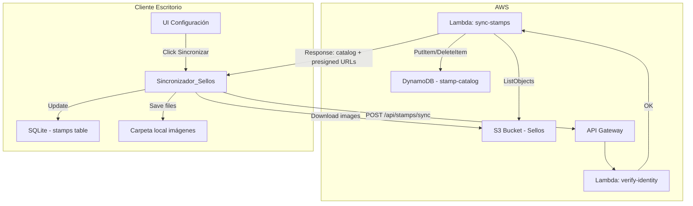
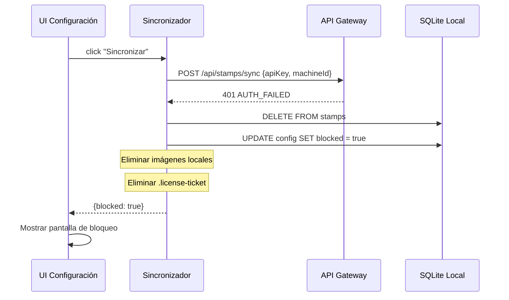

# Diseño Técnico: Base de Datos de Sellos en la Nube

## Resumen

El sistema utiliza S3 como almacenamiento primario de imágenes, DynamoDB como catálogo en la nube, y una Lambda como intermediaria que escanea el bucket y sirve los datos al cliente. La aplicación de escritorio sincroniza bajo demanda tras verificar la identidad del usuario y equipo.

## Arquitectura de Componentes



## 1. Infraestructura AWS

### 1.1 S3 Bucket: `svvs-kiosko-stamps`

Estructura de carpetas:
```
svvs-kiosko-stamps/
├── {username}/
│   ├── 2025/
│   │   ├── Feria Madrid/
│   │   │   ├── Feria Madrid-fondo.jpg
│   │   │   └── Feria Madrid-sello.png
│   │   └── Diwali 2025/
│   │       ├── Diwali 2025-fondo.jpg
│   │       └── Diwali 2025-sello.png
│   └── 2026/
│       ├── Boston 2026/
│       │   ├── Boston 2026-fondo.jpg
│       │   └── Boston 2026-sello.png
│       └── ...
└── {otro-usuario}/
    └── ...
```

Configuración:
- Acceso privado (sin acceso público)
- Versionado desactivado (las imágenes se sobreescriben)
- Cifrado SSE-S3 por defecto
- Política de acceso: solo la Lambda tiene permiso de lectura (s3:ListBucket, s3:GetObject)
- Presigned URLs para descarga directa al cliente (expiración: 5 minutos)

### 1.2 DynamoDB: tabla `svvs-kiosko-stamp-catalog`

| Atributo | Tipo | Descripción |
|----------|------|-------------|
| `username` (PK) | String | Nombre de usuario |
| `stampId` (SK) | String | `{año}#{nombre-sello}` |
| `year` | String | Año del sello |
| `stampName` | String | Nombre del sello |
| `fondoKey` | String | Ruta S3 al archivo de fondo |
| `logoKey` | String | Ruta S3 al archivo de logo |
| `status` | String | `complete` / `incomplete` |
| `createdAt` | String | ISO 8601 fecha de alta |
| `updatedAt` | String | ISO 8601 última actualización |

Modo de facturación: PAY_PER_REQUEST (bajo demanda).

### 1.3 Lambda: `svvs-kiosko-sync-stamps`

Responsabilidades:
1. Verificar identidad (apiKey + machineId contra tabla `svvs-kiosko-users`)
2. Escanear el bucket del usuario (`s3:ListObjectsV2` con prefix `{username}/`)
3. Comparar con los registros existentes en DynamoDB
4. Crear/eliminar registros según diferencias detectadas
5. Devolver el catálogo actualizado + URLs prefirmadas para las imágenes

Permisos IAM necesarios:
- `s3:ListBucket` y `s3:GetObject` sobre `svvs-kiosko-stamps`
- `dynamodb:Query`, `dynamodb:PutItem`, `dynamodb:DeleteItem` sobre `svvs-kiosko-stamp-catalog`
- `dynamodb:GetItem`, `dynamodb:Scan` sobre `svvs-kiosko-users` (verificación)

### 1.4 API Gateway: endpoint `/api/stamps/sync`

- Método: POST
- Body: `{ "apiKey": "...", "machineId": "..." }`
- Respuesta exitosa (200):
```json
{
  "ok": true,
  "catalog": [
    {
      "stampId": "2026#Boston 2026",
      "year": "2026",
      "stampName": "Boston 2026",
      "fondoUrl": "https://...presigned...",
      "logoUrl": "https://...presigned...",
      "status": "complete"
    }
  ],
  "summary": { "total": 15, "added": 2, "removed": 1 }
}
```
- Respuesta de error de autenticación (401):
```json
{
  "ok": false,
  "error": "AUTH_FAILED",
  "reason": "machineId no registrado para este usuario"
}
```

## 2. Cliente Escritorio

### 2.1 Migración SQLite: tabla `stamps`

```sql
CREATE TABLE IF NOT EXISTS stamps (
  id INTEGER PRIMARY KEY AUTOINCREMENT,
  stamp_id TEXT NOT NULL UNIQUE,
  year TEXT NOT NULL,
  stamp_name TEXT NOT NULL,
  fondo_path TEXT,
  logo_path TEXT,
  status TEXT NOT NULL DEFAULT 'complete',
  synced_at TEXT NOT NULL,
  created_at TEXT DEFAULT (datetime('now'))
);

CREATE INDEX idx_stamps_year ON stamps(year);
```

### 2.2 Servicio: `src/main/stamps/stamp-sync-service.ts`

```typescript
interface StampSyncResult {
  ok: boolean
  added: number
  removed: number
  error?: string
  blocked?: boolean
}

async function syncStamps(): Promise<StampSyncResult> {
  // 1. Obtener apiKey y machineId
  // 2. POST /api/stamps/sync
  // 3. Si error AUTH_FAILED → borrar DB local + bloquear
  // 4. Si ok → comparar catálogo con DB local
  // 5. Descargar imágenes nuevas (presigned URLs)
  // 6. Eliminar imágenes borradas
  // 7. Actualizar tabla stamps
  // 8. Devolver resumen
}
```

### 2.3 Almacenamiento local de imágenes

Ruta: `{userData}/stamps/{año}/{nombre-sello}/`
- `{nombre}-fondo.jpg`
- `{nombre}-sello.png`

Esto replica la estructura de `bbdd-ferias` pero dentro del directorio de datos de la aplicación, independiente del directorio de instalación.

### 2.4 Campo en configuración: `stampDatabase`

Se añade al `AppConfig` en el config repository:

```typescript
interface StampDatabaseConfig {
  lastSyncAt: string | null
  totalStamps: number
  syncStatus: 'idle' | 'syncing' | 'error' | 'blocked'
}
```

### 2.5 Flujo de bloqueo



## 3. Decisiones de diseño

| Decisión | Justificación |
|----------|---------------|
| DynamoDB como BBDD_Nube | Ya existe la tabla users en DynamoDB; mismo servicio, sin coste adicional por infraestructura nueva. PAY_PER_REQUEST adecuado para bajo volumen. |
| Lambda única (sync-stamps) | Un solo endpoint que verifica + escanea + responde simplifica el flujo y reduce latencia (una sola llamada HTTP desde el cliente). |
| Presigned URLs para descarga | El cliente descarga directamente de S3 sin pasar por Lambda, reduciendo coste y tiempo de transferencia. |
| Escaneo on-demand (no S3 Events) | Con 4-50 usuarios y sincronizaciones infrecuentes, un escaneo bajo demanda es más sencillo y barato que configurar S3 Event Notifications + SQS + Lambda reactiva. |
| Bloqueo persistente en SQLite | Almacenar el flag de bloqueo en la DB local garantiza que sobrevive reinicios sin necesidad de archivos externos adicionales. |
| Estructura local replicando S3 | Facilita la migración desde `bbdd-ferias` y mantiene compatibilidad con el `stamp-renderer` existente que espera rutas `{año}/{nombre}/archivo`. |

## 4. Consideraciones de seguridad

- Las presigned URLs expiran en 5 minutos, limitando la ventana de uso.
- El machineId se valida contra la lista de máquinas activas del usuario en DynamoDB.
- El bloqueo elimina tanto datos como credenciales locales, impidiendo uso offline posterior.
- La Lambda no expone las rutas internas de S3; solo genera URLs temporales.
- No se almacenan credenciales AWS en el cliente; todo acceso es mediante API Gateway + apiKey.
