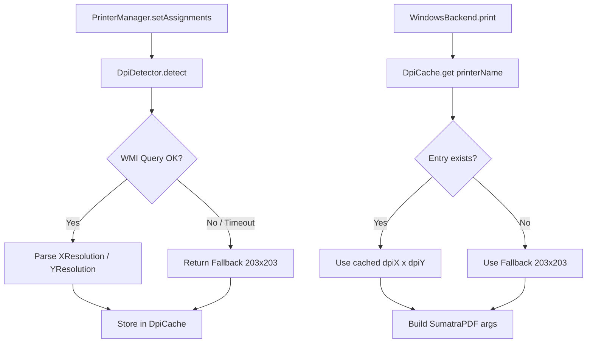

# Design Document: Dynamic Printer DPI

## Overview

This feature replaces the hardcoded `PRINT_DPI = '300x300dpi'` constant in `windows-backend.ts` with a runtime DPI detection mechanism. When a printer is assigned (at startup or via UI), the system queries Windows for the printer's native resolution using WMI (`Win32_PrinterConfiguration`) and caches the result. At print time, the cached DPI is injected into the SumatraPDF `-print-settings` argument, ensuring rasterization matches the printer's physical resolution.

This eliminates the driver-side downscaling that currently degrades output on the Brother TD-4100N (203 DPI native receiving a 300 DPI bitmap).

## Architecture



**Key design decisions:**

1. **WMI over Get-PrinterProperty**: `Win32_PrinterConfiguration` is available on all Windows versions (7+) and exposes `XResolution` / `YResolution` directly. `Get-PrinterProperty` requires Print Management module and its property names are driver-specific (inconsistent across vendors).

2. **Detection at assignment time, not print time**: Avoids adding latency to every print job. The DPI of physical hardware doesn't change between prints.

3. **Fallback to 203x203**: The Brother TD-4100N (the primary target printer) is 203 DPI. If detection fails, using 203 is safer than 300 — it avoids upscaling artifacts on the most common hardware.

4. **In-memory cache, no persistence**: DPI is cheap to detect (~100ms) and the app starts infrequently. No need to persist across sessions; a fresh detection at startup avoids stale data if hardware changes.

## Components and Interfaces

### DpiDetector

A standalone module (`dpi-detector.ts`) in `src/main/printing/`.

```typescript
export interface DpiResult {
  dpiX: number  // Horizontal resolution (positive integer)
  dpiY: number  // Vertical resolution (positive integer)
}

export const FALLBACK_DPI: DpiResult = { dpiX: 203, dpiY: 203 }

export interface DpiDetector {
  /**
   * Queries Windows for the native DPI of the given printer.
   * Returns FALLBACK_DPI on any failure (timeout, bad data, missing printer).
   */
  detect(printerName: string): Promise<DpiResult>
}
```

**Implementation**: Executes a PowerShell one-liner via the existing `WindowsCommandExecutor`:

```powershell
Get-CimInstance -ClassName Win32_PrinterConfiguration -Filter "Name='<printerName>'" | Select-Object XResolution, YResolution | ConvertTo-Json -Compress
```

Parsing logic:
- Parse JSON from stdout
- Extract `XResolution` and `YResolution`
- Validate both are positive integers (> 0)
- On any parse failure, return `FALLBACK_DPI`

Timeout: 5000ms (passed to executor).

### DpiCache

A simple in-memory `Map<string, DpiResult>` encapsulated in a class for testability:

```typescript
export class DpiCache {
  private cache: Map<string, DpiResult> = new Map()

  get(printerName: string): DpiResult | undefined
  set(printerName: string, dpi: DpiResult): void
  delete(printerName: string): void
  clear(): void
  get size(): number
}
```

### Integration Points

1. **PrinterManager.setAssignments()** — After updating assignments, iterates new URIs, extracts printer names via `getWindowsPrinterName()`, and calls `DpiDetector.detect()` for each. Stores results in the shared `DpiCache`.

2. **WindowsBackend.print()** — Before building SumatraPDF args, looks up the target printer's DPI from `DpiCache`. Uses `FALLBACK_DPI` if not found.

3. **Application startup** — Wherever the initial assignments are loaded from the database and passed to `PrinterManager.setAssignments()`, DPI detection fires automatically for all assigned printers.

### Modified Components

| Component | Change |
|-----------|--------|
| `windows-backend.ts` | Remove `PRINT_DPI` constant. Accept `DpiCache` in constructor. Look up DPI per printer in `print()`. |
| `printer-manager.ts` | Accept `DpiDetector` + `DpiCache` in constructor. Trigger detection in `setAssignments()`. |
| `printer.handlers.ts` | Pass shared `DpiCache` and `DpiDetector` instances when creating `PrinterManager`. |

## Data Models

### DpiResult

```typescript
interface DpiResult {
  dpiX: number  // Horizontal DPI (positive integer, e.g. 203, 300, 600)
  dpiY: number  // Vertical DPI (positive integer, e.g. 203, 300, 600)
}
```

### DpiCache Internal State

```typescript
// Key: printer name (decoded from URI, e.g. "Brother TD-4100N")
// Value: DpiResult
Map<string, DpiResult>
```

### WMI Query Response Shape (parsed from JSON stdout)

```typescript
interface WmiPrinterConfig {
  XResolution: number | null
  YResolution: number | null
}
```

## Correctness Properties

*A property is a characteristic or behavior that should hold true across all valid executions of a system — essentially, a formal statement about what the system should do. Properties serve as the bridge between human-readable specifications and machine-verifiable correctness guarantees.*

### Property 1: DPI Parsing Correctness

*For any* string returned by the WMI command executor, if it contains valid JSON with positive integer fields `XResolution` and `YResolution`, the detector SHALL return those exact values; otherwise it SHALL return the fallback `{dpiX: 203, dpiY: 203}`.

**Validates: Requirements 1.2, 1.3, 1.4**

### Property 2: Cache Invariant

*For any* sequence of `detect` and `invalidate` operations on the DPI cache, the cache SHALL contain exactly one entry per unique printer name reflecting its most recently detected value, and lookups for a cached printer SHALL return the stored value without invoking the system executor.

**Validates: Requirements 2.1, 2.2, 2.5**

### Property 3: Detection Triggered on Assignment

*For any* call to `setAssignments` (whether at startup or runtime), the DPI detector SHALL be invoked exactly once for each newly assigned printer name, and the resulting DPI SHALL be stored in the cache (using fallback if detection fails).

**Validates: Requirements 2.4, 4.1, 4.2, 4.3**

### Property 4: SumatraPDF Command Construction

*For any* printer name and cached DPI pair `(dpiX, dpiY)`, the SumatraPDF invocation SHALL include `-print-settings "noscale,{dpiX}x{dpiY}dpi"` and SHALL preserve all other arguments (`-print-to`, `-silent`, temp file path) unchanged.

**Validates: Requirements 3.1, 3.2, 3.4**

## Error Handling

| Scenario | Behavior |
|----------|----------|
| PowerShell command times out (>5s) | Return `FALLBACK_DPI`. Log warning. |
| PowerShell returns non-zero exit / stderr | Return `FALLBACK_DPI`. Log warning. |
| JSON parse error | Return `FALLBACK_DPI`. Log warning. |
| XResolution/YResolution missing or ≤ 0 | Return `FALLBACK_DPI`. Log warning. |
| Printer name not found in Windows | WMI returns empty result → parse fails → `FALLBACK_DPI`. |
| DpiCache has no entry at print time | Use `FALLBACK_DPI` directly (no additional query — detection should have happened at assignment). |

All errors are non-fatal. The print pipeline continues with fallback values, ensuring the operator never sees a failure caused by DPI detection.

## Testing Strategy

### Property-Based Tests (fast-check, minimum 100 iterations each)

The feature's pure logic (parsing, caching, command construction) is well-suited for property-based testing.

**Library**: `fast-check` (already in the project)
**Runner**: `vitest`
**Minimum iterations**: 100 per property

Each property test file will reference the design property it validates using the tag format:

```
Feature: dynamic-printer-dpi, Property {N}: {title}
```

| Property | What is generated | What is verified |
|----------|-------------------|------------------|
| 1 - DPI Parsing | Random JSON strings (valid and invalid WMI-shaped objects) | Correct extraction or fallback |
| 2 - Cache Invariant | Random sequences of set/get/delete operations with arbitrary printer names | One entry per name, no duplicate keys, get returns latest value |
| 3 - Detection on Assignment | Random sets of printer URIs passed to setAssignments | Detector called once per new URI, cache populated |
| 4 - Command Construction | Random printer names + DPI pairs (1–9999) | Args array matches expected format, other args unchanged |

### Unit Tests (example-based)

- Verifying the exact PowerShell command string generated for a known printer name (e.g. "Brother TD-4100N")
- Confirming the `PRINT_DPI` constant no longer exists
- Confirming `PrintOptions` interface has not changed (TypeScript compiler check)
- Edge case: printer name with special characters (quotes, spaces, unicode)

### Integration Tests

- End-to-end test with a mocked `WindowsCommandExecutor` that returns real-shaped WMI output for a known printer, then verifies the full pipeline: detect → cache → print → correct args
- Regression test: existing `printer-routing.property.test.ts` continues to pass (no API change)
