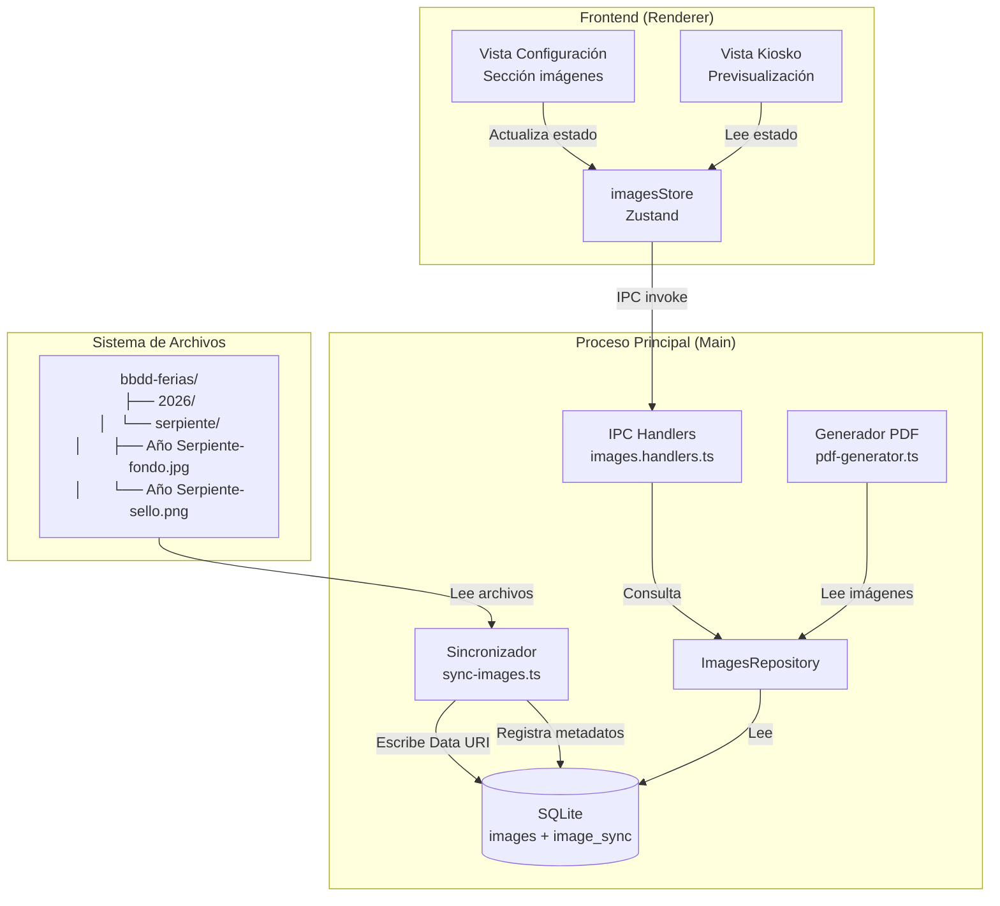
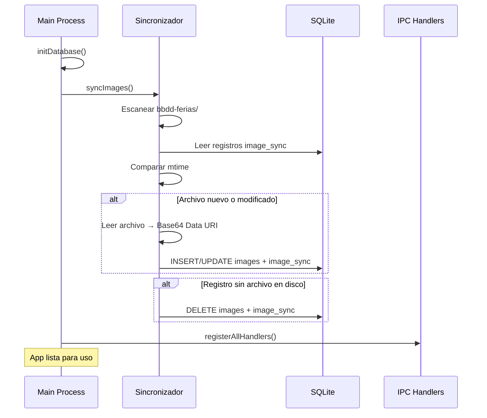
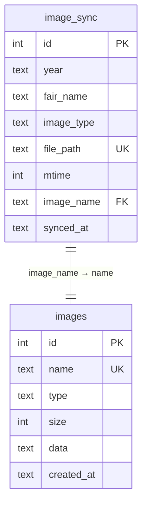

# Documento de Diseño: image-upload-ferias

## Visión General

Este diseño define la implementación del sistema de gestión de imágenes basado en carpetas para la aplicación de sellos. El sistema reemplaza la subida manual de imágenes por una **sincronización automática** que lee la estructura de carpetas `bbdd-ferias/{año}/{nombre_feria}/` al arrancar la aplicación, importa las imágenes a SQLite como Data URI Base64, y expone controles en el frontend para seleccionar la feria activa y configurar qué capas de imagen se incluyen en las etiquetas impresas.

### Decisiones Clave de Diseño

1. **Sincronización al arranque (no file watcher)**: Se ejecuta una sola vez al iniciar la app. Es más simple, predecible y suficiente para el caso de uso (las imágenes cambian entre sesiones, no durante).
2. **Detección de cambios por mtime**: Comparamos la fecha de modificación del archivo con la almacenada. Es rápido y no requiere calcular hashes.
3. **Reutilización de la tabla `images` existente**: La tabla actual ya almacena Data URI. Añadimos una tabla `image_sync` para metadatos de sincronización (year, fair_name, image_type, file_path, mtime).
4. **Composición por capas en el PDF**: El `Generador_PDF` existente ya recibe `backgroundImage`. Se extiende para soportar dos imágenes opcionales (fondo + sello) con orden de capas definido.
5. **Persistencia selectiva de checkboxes**: `imprimir_sello` se persiste en SQLite (config); `imprimir_fondo` es volátil (solo memoria, se resetea al reiniciar).

## Arquitectura



### Flujo de Arranque



## Componentes e Interfaces

### 1. Sincronizador (`src/main/images/sync-images.ts`)

Módulo responsable de la sincronización de carpetas con la base de datos.

```typescript
/** Metadatos de un archivo de imagen detectado en disco */
interface ScannedImageFile {
  year: string
  fairName: string
  imageType: 'fondo' | 'sello'
  filePath: string       // ruta absoluta
  relativePath: string   // ruta relativa a bbdd-ferias/
  fileName: string       // nombre del archivo sin ruta
  mtime: number          // timestamp de modificación (ms)
}

/** Registro de sincronización almacenado en SQLite */
interface SyncRecord {
  id: number
  year: string
  fairName: string
  imageType: 'fondo' | 'sello'
  filePath: string
  mtime: number
  imageName: string  // referencia al name en tabla images
}

/** Resultado de la sincronización */
interface SyncResult {
  inserted: number
  updated: number
  deleted: number
  unchanged: number
  errors: Array<{ path: string; error: string }>
}

/** Función principal de sincronización */
function syncImages(basePath: string): SyncResult

/** Escanea la estructura de carpetas y devuelve los archivos encontrados */
function scanFairFolders(basePath: string): ScannedImageFile[]

/** Clasifica un archivo por su sufijo (-fondo, -sello) */
function classifyImageFile(fileName: string): 'fondo' | 'sello' | null

/** Genera el nombre único para la tabla images: `{year}/{fairName}-{tipo}` */
function buildImageName(year: string, fairName: string, imageType: string): string

/** Convierte un archivo de imagen a Data URI Base64 */
function fileToDataUri(filePath: string): string
```

### 2. ImageSyncRepository (`src/main/database/repositories/image-sync.repository.ts`)

Repositorio para la tabla `image_sync` que almacena metadatos de sincronización.

```typescript
interface ImageSyncRecord {
  id: number
  year: string
  fair_name: string
  image_type: 'fondo' | 'sello'
  file_path: string
  mtime: number
  image_name: string
  synced_at: string
}

class ImageSyncRepository {
  /** Obtener todos los registros de sync */
  getAll(): ImageSyncRecord[]

  /** Obtener registro por ruta de archivo */
  getByFilePath(filePath: string): ImageSyncRecord | null

  /** Insertar o actualizar un registro de sync */
  upsert(record: Omit<ImageSyncRecord, 'id' | 'synced_at'>): void

  /** Eliminar registros cuyas rutas no están en la lista dada */
  deleteOrphans(validPaths: string[]): number

  /** Obtener lista de ferias únicas (año + nombre) */
  getFairList(): Array<{ year: string; fairName: string }>

  /** Obtener imágenes de una feria específica */
  getByFair(year: string, fairName: string): ImageSyncRecord[]
}
```

### 3. IPC Handlers extendidos (`src/main/ipc/images.handlers.ts`)

Se añaden nuevos canales IPC manteniendo los existentes:

```typescript
// Canales nuevos:
'images:getFairList'    → () => Array<{ year: string; fairName: string }>
'images:getByFair'      → (year: string, fairName: string) => { fondo: string | null; sello: string | null }
'images:getSyncStatus'  → () => SyncResult | null
```

### 4. Images Store (`src/renderer/src/stores/images.store.ts`)

Store Zustand para gestionar el estado de imágenes en el frontend.

```typescript
interface ImagesState {
  /** Lista de ferias disponibles */
  fairList: Array<{ year: string; fairName: string }>
  /** Feria actualmente seleccionada */
  activeFair: { year: string; fairName: string } | null
  /** Imagen de fondo de la feria activa (Data URI o null) */
  fondoImage: string | null
  /** Imagen del sello de la feria activa (Data URI o null) */
  selloImage: string | null
  /** Checkbox: imprimir imagen de fondo (volátil, default false) */
  printFondo: boolean
  /** Checkbox: imprimir imagen del sello (persistido en config) */
  printSello: boolean
  /** Estado de carga */
  loading: boolean
  error: string | null

  // Acciones
  loadFairList: () => Promise<void>
  selectFair: (year: string, fairName: string) => Promise<void>
  setPrintFondo: (value: boolean) => void
  setPrintSello: (value: boolean) => Promise<void>
}
```

### 5. Generador PDF extendido

Se modifica la función `generateSalePdfs` para recibir las opciones de capas de imagen:

```typescript
interface ImageLayerOptions {
  printFondo: boolean
  printSello: boolean
  fondoImage: string | null  // Data URI
  selloImage: string | null  // Data URI
}

// La función existente getModelBackground() se reemplaza/extiende
// para consultar las imágenes de la feria activa según las opciones de capas.
```

## Modelos de Datos

### Nueva tabla: `image_sync`

```sql
-- Migration 003: image_sync table
CREATE TABLE IF NOT EXISTS image_sync (
    id INTEGER PRIMARY KEY AUTOINCREMENT,
    year TEXT NOT NULL,
    fair_name TEXT NOT NULL,
    image_type TEXT NOT NULL CHECK(image_type IN ('fondo', 'sello')),
    file_path TEXT NOT NULL UNIQUE,
    mtime INTEGER NOT NULL,
    image_name TEXT NOT NULL,
    synced_at TEXT DEFAULT (datetime('now')),
    UNIQUE(year, fair_name, image_type)
);

CREATE INDEX IF NOT EXISTS idx_image_sync_fair
    ON image_sync(year, fair_name);
```

### Extensión tabla `config`

Se añade al JSON de configuración un campo para persistir el estado del checkbox `imprimir_sello`:

```json
{
  "ticket": { ... },
  "codigo": { ... },
  "sello": { ... },
  "precios": { ... },
  "imagenes": {
    "printSello": true,
    "activeFair": { "year": "2026", "fairName": "serpiente" }
  }
}
```

El campo `printFondo` **NO se persiste** (siempre empieza en `false` al reiniciar).

### Relación entre tablas



## Correctness Properties

*Una propiedad de corrección es una característica o comportamiento que debe mantenerse verdadero en todas las ejecuciones válidas de un sistema — esencialmente, una declaración formal sobre lo que el sistema debe hacer. Las propiedades sirven como puente entre especificaciones legibles por humanos y garantías de corrección verificables por máquina.*

### Property 1: Clasificación correcta por sufijo

*For any* archivo con nombre válido (no vacío) y extensión `.jpg` o `.png`, la función `classifyImageFile` SHALL devolver `'fondo'` si y solo si el nombre termina en `-fondo` antes de la extensión, `'sello'` si y solo si termina en `-sello`, y `null` en cualquier otro caso.

**Validates: Requirements 1.1, 1.2, 1.3**

### Property 2: Tolerancia a carpetas incompletas

*For any* estructura de carpeta de feria válida (año + nombre), si la carpeta no contiene archivo `-fondo` o no contiene archivo `-sello` (o ambos), el sincronizador SHALL completar sin lanzar excepción y SHALL devolver un `SyncResult` donde `errors` no contiene entradas relativas a esa carpeta por archivos faltantes.

**Validates: Requirements 1.4, 1.5**

### Property 3: Corrección de la sincronización

*For any* conjunto de archivos en disco y registros existentes en `image_sync`, después de ejecutar `syncImages`:
- Todo archivo nuevo (no en `image_sync`) SHALL tener un registro insertado con el mtime correcto
- Todo archivo con mtime posterior al registrado SHALL tener su registro y Data URI actualizados
- Todo registro sin archivo correspondiente en disco SHALL ser eliminado
- La cantidad total de operaciones (inserted + updated + deleted + unchanged) SHALL ser igual al máximo entre archivos en disco y registros previos

**Validates: Requirements 2.2, 2.3, 2.4, 2.5**

### Property 4: Idempotencia de sincronización

*For any* estado donde los archivos en disco no han cambiado desde la última sincronización, ejecutar `syncImages` SHALL producir un `SyncResult` con `inserted=0`, `updated=0`, `deleted=0` y `unchanged` igual al número total de archivos rastreados.

**Validates: Requirements 2.6**

### Property 5: Composición correcta de capas en PDF

*For any* combinación de estados de los checkboxes (`printFondo`, `printSello`) y cualquier par de imágenes válidas (fondo, sello), la composición de capas en la etiqueta generada SHALL seguir estas reglas:
- Si `printSello=true` y `printFondo=false`: capas = [sello, texto]
- Si `printFondo=true` y `printSello=false`: capas = [fondo, texto]
- Si ambos `true`: capas = [fondo, sello, texto]
- Si ambos `false`: capas = [texto]

Donde cada capa posterior se renderiza encima de la anterior.

**Validates: Requirements 5.3, 5.4, 6.2, 6.3, 7.1, 7.2, 7.3, 7.4**

## Manejo de Errores

| Escenario | Comportamiento | Impacto en usuario |
|-----------|---------------|-------------------|
| Carpeta `bbdd-ferias/` no existe | Sync completa con 0 operaciones, log warning | App funciona sin imágenes |
| Archivo de imagen corrupto (no se puede leer) | Se registra en `errors` del SyncResult, se salta ese archivo | La feria aparece pero sin esa imagen |
| Archivo con extensión no soportada | Se ignora silenciosamente | Sin efecto visible |
| Error de escritura en SQLite durante sync | Se captura por archivo, no aborta toda la sync | Algunas imágenes pueden faltar |
| IPC `images:getByFair` con feria inexistente | Devuelve `{ fondo: null, sello: null }` | Vista muestra placeholder |
| Checkbox sello activado pero imagen no disponible | PDF se genera sin imagen, se muestra notificación al usuario | Usuario informado |
| Permiso denegado al leer archivo | Se registra en `errors`, se salta | Imagen no disponible |

### Estrategia de logging

- **Info**: Inicio/fin de sincronización, número de operaciones
- **Warn**: Carpeta sin imágenes, archivos con extensión no soportada
- **Error**: Archivos que no se pueden leer, errores de escritura SQLite

## Estrategia de Testing

### Tests Unitarios (ejemplo-based)

| Módulo | Tests |
|--------|-------|
| `classifyImageFile` | Casos concretos: "Año Serpiente-fondo.jpg" → 'fondo', "foto.jpg" → null |
| `buildImageName` | Formato correcto: "2026/serpiente-fondo" |
| `fileToDataUri` | Conversión correcta de archivo a data URI |
| `ImageSyncRepository` | CRUD operations con base de datos en memoria |
| `ImagesStore` | Estado inicial, selección de feria, toggle checkboxes |
| Vista Configuración | Renderiza lista de ferias, checkboxes con labels correctos |
| Vista Kiosko | Muestra imagen o placeholder según disponibilidad |

### Tests de Propiedad (property-based)

Se usa la librería **fast-check** (ya presente en devDependencies).

| Property | Módulo bajo test | Iteraciones |
|----------|-----------------|-------------|
| Property 1: Clasificación por sufijo | `classifyImageFile` | 100+ |
| Property 2: Tolerancia a carpetas incompletas | `syncImages` (con fs mock) | 100+ |
| Property 3: Corrección de sincronización | `syncImages` (con fs mock + db en memoria) | 100+ |
| Property 4: Idempotencia de sincronización | `syncImages` (con fs mock + db en memoria) | 100+ |
| Property 5: Composición de capas PDF | Lógica de composición de capas | 100+ |

**Configuración de PBT:**
- Mínimo 100 iteraciones por test
- Cada test referencia su propiedad del documento de diseño
- Formato de tag: `Feature: image-upload-ferias, Property {N}: {título}`
- Los generadores producirán: nombres de archivo con caracteres especiales, estructuras de carpetas variables, combinaciones de checkbox states, imágenes Data URI mock

### Tests de Integración

| Test | Descripción |
|------|-------------|
| Sync end-to-end | Crear estructura temporal de carpetas, ejecutar sync, verificar BD |
| IPC getFairList | Verificar que devuelve datos correctos tras sync |
| IPC getByFair | Verificar que devuelve imágenes Data URI correctas |
| PDF con capas | Generar PDF con diferentes combinaciones y verificar output |

### Tests de Humo (Smoke)

| Test | Descripción |
|------|-------------|
| Checkboxes render | Verificar que ambos checkboxes están presentes en Vista Configuración |
| App arranca sin bbdd-ferias | Verificar que la app no crashea si la carpeta no existe |
