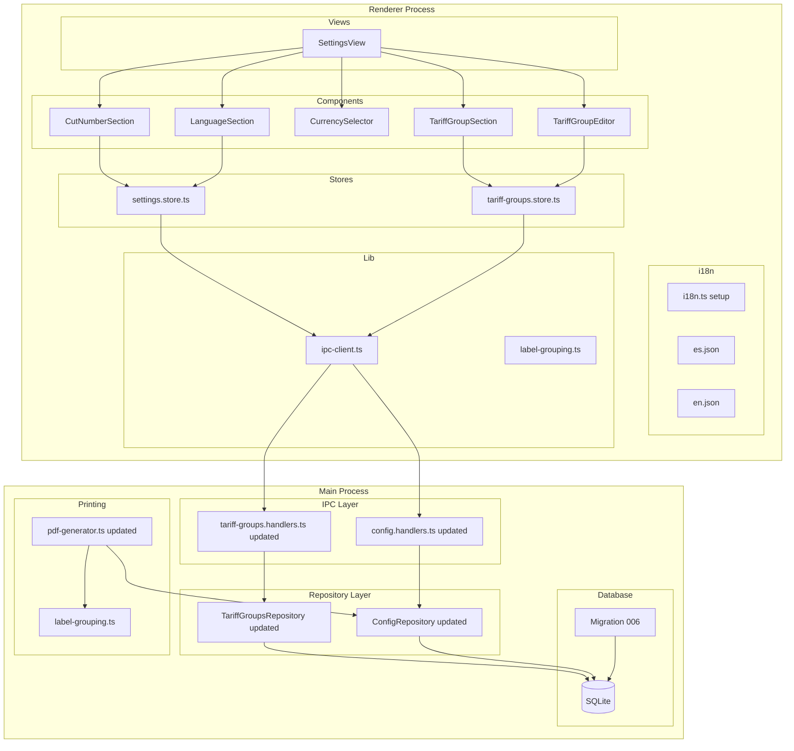
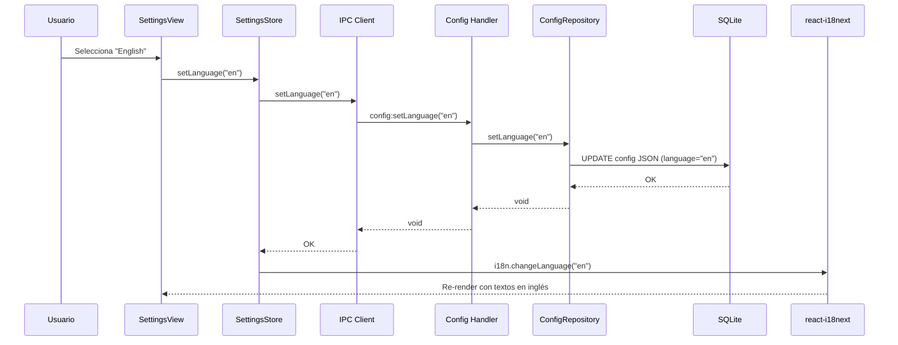
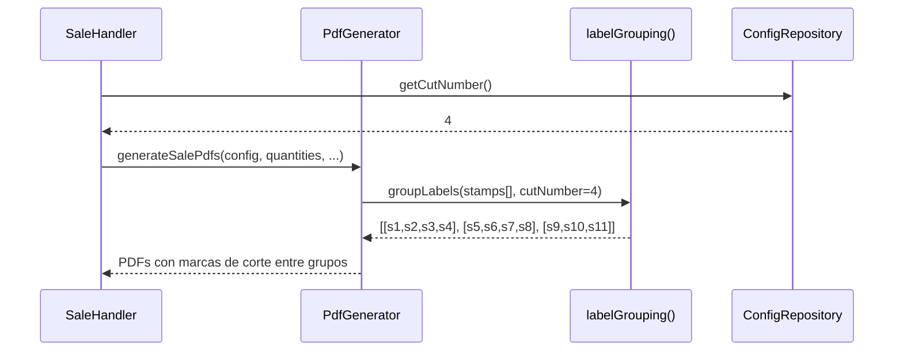
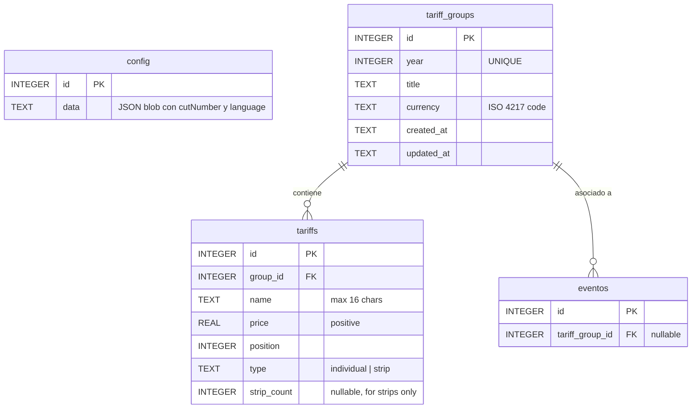

# Documento de Diseño: Configuración, Tarifas e Internacionalización

## Overview

Este documento describe el diseño técnico para la nueva vista de Configuración (Settings), la evolución del sistema de grupos de tarifas con tipos diferenciados (individuales y tiras), la restricción de un grupo por año, el selector de moneda, el número de corte para agrupamiento de etiquetas, y la internacionalización (i18n) de la aplicación.

El diseño evoluciona el sistema de tariff-groups existente (migración 005) para soportar:
1. Restricción UNIQUE por año (en lugar de año+título).
2. Dos tipos de tarifa: `individual` y `strip` (tira), con un campo `strip_count` para las tiras.
3. Ampliación de 2-10 a 2-20 tarifas individuales por grupo.
4. Un nuevo módulo de configuración global (número de corte + idioma) persistido en la tabla `config`.
5. Sistema i18n con `react-i18next` y archivos JSON de traducción.
6. Una nueva vista `SettingsView` que centraliza tarifas, número de corte e idioma.

La arquitectura sigue el patrón establecido: SQLite → Repository → IPC Handlers → Preload Bridge → Zustand Store → React Components.

## Architecture

### Diagrama de Arquitectura General



### Diagrama de Flujo: Cambio de Idioma



### Diagrama de Flujo: Agrupamiento de Etiquetas por Número de Corte



## Components and Interfaces

### Tipos TypeScript Actualizados

```typescript
// ─── Tariff Types (evolved from existing) ─────────────────────────────────────

/** Tipo de tarifa: individual o tira */
export type TariffType = 'individual' | 'strip'

/** Tarifa dentro de un grupo (evolución del tipo existente) */
export interface Tariff {
  id?: number
  name: string          // máximo 16 caracteres
  price: number         // positivo
  position: number      // orden dentro del grupo (1-based)
  type: TariffType      // NEW: tipo de tarifa
  strip_count?: number  // NEW: solo para type='strip', cuántas individuales abarca (≥2)
}

/** Grupo de tarifas con restricción de un grupo por año */
export interface TariffGroup {
  id: number
  year: number
  title: string
  currency: string      // código ISO (EUR, USD, GBP, etc.)
  tariffs: Tariff[]     // incluye ambos tipos: individuales y tiras
  created_at: string
  updated_at: string
}

/** Input para crear un grupo con tipos diferenciados */
export interface TariffGroupInput {
  year: number
  title: string
  currency: string
  tariffs: TariffInput[]
}

/** Input para una tarifa individual o tira */
export interface TariffInput {
  name: string
  price: number
  position: number
  type: TariffType
  strip_count?: number  // requerido si type='strip'
}

// ─── Currency Types ───────────────────────────────────────────────────────────

/** Definición de moneda predefinida */
export interface CurrencyDef {
  code: string    // ISO 4217: "EUR", "USD", etc.
  symbol: string  // "€", "$", "£", etc.
  label: string   // "EUR €", "USD $", etc.
}

/** Lista predefinida de monedas */
export const CURRENCIES: CurrencyDef[] = [
  { code: 'EUR', symbol: '€', label: 'EUR €' },
  { code: 'USD', symbol: '$', label: 'USD $' },
  { code: 'GBP', symbol: '£', label: 'GBP £' },
  { code: 'CHF', symbol: 'Fr', label: 'CHF Fr' },
  { code: 'JPY', symbol: '¥', label: 'JPY ¥' },
  { code: 'CNY', symbol: '¥', label: 'CNY ¥' },
  { code: 'MXN', symbol: '$', label: 'MXN $' },
  { code: 'ARS', symbol: '$', label: 'ARS $' },
  { code: 'COP', symbol: '$', label: 'COP $' },
  { code: 'BRL', symbol: 'R$', label: 'BRL R$' },
]

// ─── Settings / Config Types ──────────────────────────────────────────────────

/** Supported languages */
export type AppLanguage = 'es' | 'en'

/** Global settings managed through the SettingsView */
export interface GlobalSettings {
  cutNumber: number     // 2-16, default 4
  language: AppLanguage // 'es' | 'en', default 'es'
}
```

### Evolución del Repository: TariffGroupsRepository

```typescript
export class TariffGroupsRepository {
  // Existing methods remain but validation evolves:

  /** Validates tariff input with type-aware rules */
  private validate(input: {
    title?: string
    currency?: string
    tariffs: TariffInput[]
  }): void
  // - 2-20 individual tariffs (up from 2-10)
  // - strip_count ≥ 2 for type='strip'
  // - strip_count ≤ total individual tariffs in same group
  // - Name 1-16 chars for all tariff types
  // - Price > 0 for all tariff types

  /** Create with new uniqueness: one group per year */
  create(input: TariffGroupInput): TariffGroup

  /** Update with new uniqueness check */
  update(id: number, input: TariffGroupUpdateInput): TariffGroup | null

  // Existing methods unchanged: getYears, getAll, getByYear, getById, delete
}
```

### Nuevo: ConfigRepository (extensiones)

```typescript
export class ConfigRepository {
  // Existing methods remain unchanged...

  /** Get the cut number from config, returns default 4 if unset */
  getCutNumber(): number

  /** Set the cut number (validated 2-16) */
  setCutNumber(value: number): void

  /** Get the active language, returns default 'es' if unset */
  getLanguage(): AppLanguage

  /** Set the active language (validated 'es' | 'en') */
  setLanguage(value: AppLanguage): void
}
```

### Nuevos IPC Channels

```typescript
// Extensiones a config.handlers.ts:
// - config:getCutNumber  → number
// - config:setCutNumber  → void (valida 2-16)
// - config:getLanguage   → string ('es' | 'en')
// - config:setLanguage   → void (valida 'es' | 'en')
```

### Preload Bridge (extensiones a ElectronAPI)

```typescript
export interface ElectronAPI {
  // Existing...
  config: {
    // Existing methods...
    getCutNumber(): Promise<number>
    setCutNumber(value: number): Promise<void>
    getLanguage(): Promise<string>
    setLanguage(value: string): Promise<void>
  }
}
```

### Nuevo: SettingsStore (Zustand)

```typescript
export interface SettingsState {
  cutNumber: number
  language: AppLanguage
  loading: boolean
  error: string | null

  // Actions
  loadSettings(): Promise<void>
  setCutNumber(value: number): Promise<void>
  setLanguage(value: AppLanguage): Promise<void>
}
```

### Nuevo: Label Grouping Utility

```typescript
// src/main/printing/label-grouping.ts

/**
 * Groups an array of items into chunks of the specified cut number.
 * The last chunk may have fewer items if total is not evenly divisible.
 *
 * @param items - Array of items to group
 * @param cutNumber - Size of each group (2-16)
 * @returns Array of arrays (groups)
 */
export function groupLabels<T>(items: T[], cutNumber: number): T[][]
```

### i18n Setup

```typescript
// src/renderer/src/i18n/i18n.ts
import i18n from 'i18next'
import { initReactI18next } from 'react-i18next'
import es from './locales/es.json'
import en from './locales/en.json'

i18n.use(initReactI18next).init({
  resources: { es: { translation: es }, en: { translation: en } },
  lng: 'es',           // default, overridden by persisted value
  fallbackLng: 'es',
  interpolation: { escapeValue: false },
  missingKeyHandler: false,
  parseMissingKeyHandler: (key) => key  // show key as fallback
})

export default i18n
```

### Estructura de Archivos de Traducción

```json
// src/renderer/src/i18n/locales/es.json
{
  "nav": {
    "home": "Inicio",
    "print": "Imprimir",
    "machine": "Máquina",
    "kiosko": "Kiosko",
    "settings": "Configuración"
  },
  "settings": {
    "title": "Configuración",
    "tariffGroups": "Grupos de Tarifas",
    "cutNumber": "Número de Corte",
    "language": "Idioma",
    "save": "Guardar",
    "cancel": "Cancelar"
  },
  "validation": {
    "nameRequired": "El nombre es obligatorio",
    "nameTooLong": "El nombre no puede exceder 16 caracteres",
    "pricePositive": "El precio debe ser un número positivo",
    "cutNumberMin": "El valor mínimo es 2",
    "cutNumberMax": "El valor máximo es 16",
    "minTariffs": "Se requieren al menos 2 tarifas individuales",
    "maxTariffs": "El máximo permitido es 20 tarifas individuales",
    "stripCountMin": "Una tira debe abarcar al menos 2 tarifas individuales",
    "stripCountMax": "La tira no puede abarcar más tarifas de las existentes",
    "yearDuplicate": "Ya existe un grupo para ese año"
  },
  "errors": { ... }
}
```

### Componentes React

| Componente | Ubicación | Responsabilidad |
|---|---|---|
| `SettingsView` | `views/SettingsView.tsx` | Vista principal de configuración con 3 secciones |
| `TariffGroupSection` | `components/settings/TariffGroupSection.tsx` | Lista y gestión de grupos de tarifas |
| `TariffGroupEditor` | `components/settings/TariffGroupEditor.tsx` | Formulario crear/editar grupo con tipo diferenciado |
| `CurrencySelector` | `components/settings/CurrencySelector.tsx` | Dropdown de monedas predefinidas (Radix Select) |
| `CutNumberSection` | `components/settings/CutNumberSection.tsx` | Input numérico para número de corte |
| `LanguageSection` | `components/settings/LanguageSection.tsx` | Selector de idioma (Español/English) |

## Data Models

### Migración SQL: 006_tariff_types_and_settings.sql

```sql
-- Migration 006: Add tariff types, strip_count, unique year constraint, and settings fields

-- Step 1: Add type column to tariffs (default 'individual' for existing data)
ALTER TABLE tariffs ADD COLUMN type TEXT NOT NULL DEFAULT 'individual';

-- Step 2: Add strip_count column (nullable, only used for type='strip')
ALTER TABLE tariffs ADD COLUMN strip_count INTEGER;

-- Step 3: Drop the old year+title unique index and create year-only unique index
DROP INDEX IF EXISTS idx_tariff_groups_year_title;
CREATE UNIQUE INDEX idx_tariff_groups_year ON tariff_groups(year);

-- Step 4: All existing tariffs are assigned type='individual' (already handled by DEFAULT)
-- No explicit UPDATE needed since the DEFAULT clause covers it.
```

### Esquema Resultante



### Persistencia de Settings en Config JSON

El campo `data` de la tabla `config` (id=1) se extiende con dos campos opcionales en el JSON:

```typescript
interface AppConfig {
  // Existing fields...
  ticket: TicketConfig
  codigo: CodigoConfig
  sello: SelloConfig
  precios: PreciosConfig
  imagenes?: ImagenesConfig
  // NEW:
  settings?: {
    cutNumber?: number   // default 4
    language?: string    // default 'es'
  }
}
```

La estrategia de almacenar en el JSON blob existente mantiene consistencia con el patrón actual (single-row JSON config) y evita crear tablas adicionales. Los métodos `getCutNumber()` / `setCutNumber()` y `getLanguage()` / `setLanguage()` en `ConfigRepository` leen/escriben únicamente el sub-objeto `settings`.

## Correctness Properties

*A property is a characteristic or behavior that should hold true across all valid executions of a system—essentially, a formal statement about what the system should do. Properties serve as the bridge between human-readable specifications and machine-verifiable correctness guarantees.*

### Property 1: Uniqueness per year (create and update)

*For any* year value, if a tariff group already exists for that year, attempting to create a new group for the same year SHALL be rejected with an error. Likewise, *for any* existing group, attempting to update its year to a value already used by another group SHALL be rejected.

**Validates: Requirements 2.1, 2.2, 2.3**

### Property 2: Tariff type differentiation round-trip

*For any* valid TariffGroupInput containing a mix of individual tariffs and strips (each with valid name, price, position, type, and strip_count), creating the group and then retrieving it by ID SHALL return an object with exactly the same tariffs preserving type, strip_count, name, price, position, and currency for each entry.

**Validates: Requirements 3.1, 3.7, 5.5**

### Property 3: Individual tariff cardinality bounds

*For any* TariffGroupInput with fewer than 2 individual tariffs (type='individual') or more than 20 individual tariffs, the validation SHALL reject the input. *For any* input with between 2 and 20 individual tariffs (with valid fields), the cardinality validation SHALL pass.

**Validates: Requirements 3.3, 3.4, 3.5**

### Property 4: Name validation for tariffs and strips

*For any* tariff or strip with a name that is empty or exceeds 16 characters, the validation SHALL reject it with a descriptive error message. *For any* name of 1-16 characters, the name validation SHALL pass.

**Validates: Requirements 4.1, 4.2, 4.5, 4.6**

### Property 5: Price validation for tariffs and strips

*For any* tariff or strip with a price that is ≤ 0, NaN, or non-finite, the validation SHALL reject it. *For any* positive finite number as price, the price validation SHALL pass.

**Validates: Requirements 4.3, 4.4, 4.7**

### Property 6: Strip count validation

*For any* strip where strip_count < 2, the validation SHALL reject it. *For any* strip where strip_count exceeds the number of individual tariffs defined in the same group, the validation SHALL reject it. *For any* strip_count in [2, N] where N is the individual tariff count, the validation SHALL pass.

**Validates: Requirements 4.8, 4.9**

### Property 7: Cut number persistence and range validation

*For any* integer in the range [2, 16], calling `setCutNumber(n)` and then `getCutNumber()` SHALL return exactly `n`. *For any* integer outside [2, 16], calling `setCutNumber(n)` SHALL be rejected with a descriptive error, and the previously stored value SHALL remain unchanged.

**Validates: Requirements 6.4, 8.1, 11.2, 11.5**

### Property 8: Label grouping by cut number

*For any* array of N labels (N ≥ 1) and *any* cut number K in [2, 16], the function `groupLabels(labels, K)` SHALL produce exactly `⌈N/K⌉` groups where: each group except possibly the last has exactly K elements, the last group has `N mod K` elements (or K if N is divisible by K), and the concatenation of all groups equals the original array in order.

**Validates: Requirements 6.5, 6.6, 9.1, 9.2**

### Property 9: Language config validation

*For any* string value that is not "es" or "en", calling `setLanguage(value)` SHALL be rejected with a descriptive error. For "es" or "en", calling `setLanguage(value)` and then `getLanguage()` SHALL return the set value.

**Validates: Requirements 7.4, 8.2, 11.4, 11.6**

### Property 10: i18n missing key fallback

*For any* key string that does not exist in the active translation file, the translation function `t(key)` SHALL return the key itself as fallback text.

**Validates: Requirements 12.3**

## Error Handling

### Estrategia de Errores por Capa

| Capa | Tipo de Error | Manejo |
|---|---|---|
| Migration | SQL syntax / constraint | Transacción revierte automáticamente, log de error |
| Repository | UNIQUE constraint (year) | Capturar error SQLite, devolver mensaje descriptivo |
| Repository | Validation failure | Throw con mensaje descriptivo del campo inválido |
| IPC Handler | Cualquier excepción | `handleIpc` wrapper captura y re-lanza con mensaje limpio |
| Store | Error de IPC | Almacenar en `state.error`, exponer al componente |
| Componente | Validación frontend | Impedir envío, mostrar mensajes inline traducidos (i18n) |
| i18n | Clave faltante | Mostrar la clave como texto de respaldo |

### Validación Dual (Frontend + Backend)

La validación se ejecuta en dos capas:

1. **Frontend (antes de enviar)**: Validación reactiva en el formulario:
   - Número de corte: 2-16
   - Idioma: solo "es" o "en"
   - Nombre tarifa: 1-16 caracteres
   - Precio: > 0
   - Tarifas individuales: 2-20
   - Strip count: 2 ≤ count ≤ total individuales

2. **Backend (antes de persistir)**: El repository/handler valida las mismas reglas, rechazando con errores descriptivos. Protege contra llamadas directas al IPC.

### Códigos de Error Actualizados

```typescript
export const TARIFF_GROUP_ERRORS = {
  // Existing...
  DUPLICATE_YEAR: 'Ya existe un grupo para ese año',
  MIN_INDIVIDUAL_TARIFFS: 'Se requieren al menos 2 tarifas individuales',
  MAX_INDIVIDUAL_TARIFFS: 'El máximo permitido es 20 tarifas individuales',
  STRIP_COUNT_MIN: 'Una tira debe abarcar al menos 2 tarifas individuales',
  STRIP_COUNT_EXCEEDS_TOTAL: 'La tira no puede abarcar más tarifas de las existentes',
  // Kept from existing:
  EMPTY_TITLE: 'El título es obligatorio',
  EMPTY_CURRENCY: 'El tipo de moneda es obligatorio',
  EMPTY_TARIFF_NAME: 'El nombre de la tarifa es obligatorio',
  TARIFF_NAME_TOO_LONG: 'El nombre no puede exceder 16 caracteres',
  INVALID_PRICE: 'El precio debe ser un número positivo',
  GROUP_IN_USE: 'No se puede eliminar: el grupo está asociado a eventos',
  NOT_FOUND: 'Grupo de tarifas no encontrado',
} as const

export const CONFIG_ERRORS = {
  CUT_NUMBER_OUT_OF_RANGE: 'El número de corte debe estar entre 2 y 16',
  INVALID_LANGUAGE: 'El idioma debe ser "es" o "en"',
} as const
```

## Testing Strategy

### Testing Dual: Unit Tests + Property Tests

#### Property-Based Tests (PBT)

Se utiliza **fast-check** (ya instalado en el proyecto, v4.8.0) como librería de property-based testing con Vitest.

Configuración: mínimo **100 iteraciones** por propiedad.

Cada test referencia su propiedad del documento de diseño:

```typescript
// Tag format:
// Feature: settings-tariff-i18n, Property {N}: {title}
```

**Tests de propiedad a implementar:**

| # | Propiedad | Archivo |
|---|---|---|
| 1 | Uniqueness per year | `src/main/database/__tests__/tariff-groups-evolved.property.test.ts` |
| 2 | Type differentiation round-trip | `src/main/database/__tests__/tariff-groups-evolved.property.test.ts` |
| 3 | Cardinality bounds | `src/main/database/__tests__/tariff-groups-evolved.property.test.ts` |
| 4 | Name validation | `src/main/database/__tests__/tariff-groups-evolved.property.test.ts` |
| 5 | Price validation | `src/main/database/__tests__/tariff-groups-evolved.property.test.ts` |
| 6 | Strip count validation | `src/main/database/__tests__/tariff-groups-evolved.property.test.ts` |
| 7 | Cut number persistence | `src/main/database/__tests__/config-settings.property.test.ts` |
| 8 | Label grouping | `src/main/printing/__tests__/label-grouping.property.test.ts` |
| 9 | Language config validation | `src/main/database/__tests__/config-settings.property.test.ts` |
| 10 | i18n missing key fallback | `src/renderer/src/__tests__/i18n-fallback.property.test.ts` |

#### Unit Tests (Ejemplos Específicos)

- Migración 006 se aplica correctamente sobre 005
- Datos existentes migran con type='individual'
- Vista de Configuración renderiza las 3 secciones
- Selector de moneda muestra las 10 monedas requeridas
- Selector de idioma cambia textos sin recarga
- Default cut number = 4 cuando no configurado
- Default language = 'es' cuando no configurado
- IPC channels responden correctamente (integration test)
- Formulario de grupo permite crear tarifas individuales y tiras
- Navegación muestra enlace a Settings

#### Estructura de Archivos de Tests

```
src/main/database/__tests__/tariff-groups-evolved.property.test.ts   # PBT propiedades 1-6
src/main/database/__tests__/config-settings.property.test.ts         # PBT propiedades 7, 9
src/main/printing/__tests__/label-grouping.property.test.ts          # PBT propiedad 8
src/renderer/src/__tests__/i18n-fallback.property.test.ts            # PBT propiedad 10
src/main/database/__tests__/migration-006.test.ts                    # Unit: migración
src/main/ipc/__tests__/config-settings.handlers.test.ts              # Integration: IPC
```

### Decisiones de Diseño y Justificaciones

| Decisión | Justificación |
|---|---|
| Almacenar settings en JSON blob de `config` (no tabla separada) | Consistencia con el patrón existente; evita crear tablas para solo 2 campos |
| `react-i18next` para i18n | Librería madura para React, soporta cambio de idioma en runtime sin reload |
| Restricción UNIQUE solo por año (no año+título) | Simplifica el modelo: un grupo por año es más intuitivo para el operador |
| Campo `type` en tabla `tariffs` | Permite diferenciar individuales de tiras sin tabla separada |
| `strip_count` nullable | Solo relevante para type='strip'; NULL para individuales |
| Ampliar límite de 10 a 20 tarifas individuales | El requisito explicita 2-20 para individuales |
| `groupLabels` como función pura separada | Testabilidad (PBT), reutilización, separación de responsabilidades |
| Selector de moneda con lista fija (no free-text) | Previene errores de escritura, garantiza ISO codes válidos |
| fast-check para PBT | Ya está como dependencia dev en package.json |
| Nueva ruta `/settings` en el router | Separar la configuración de la vista de impresión |
