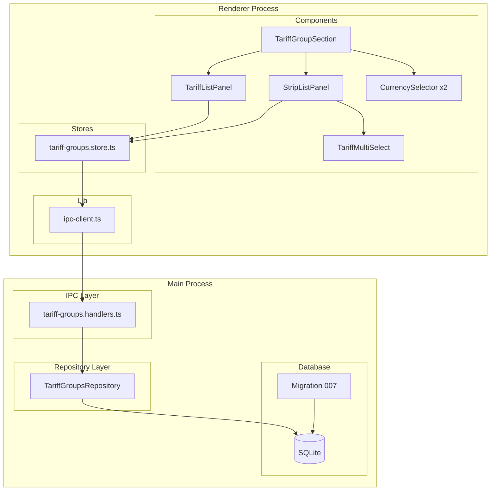
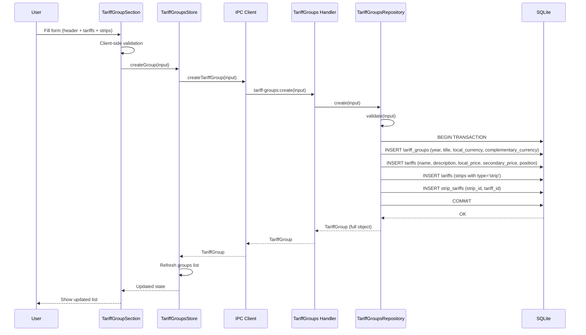
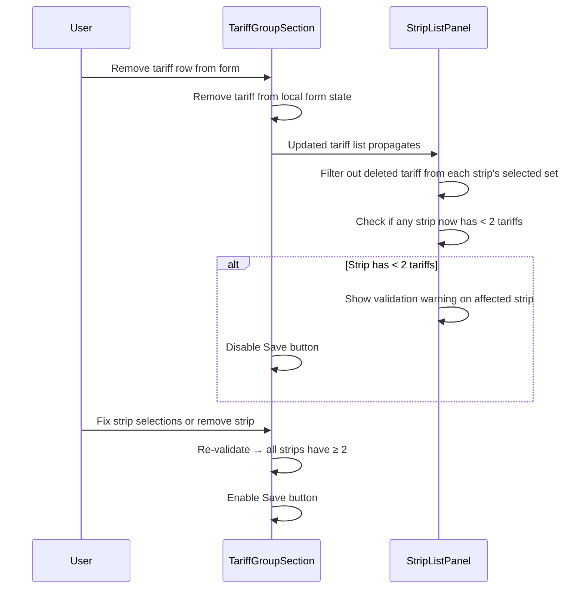
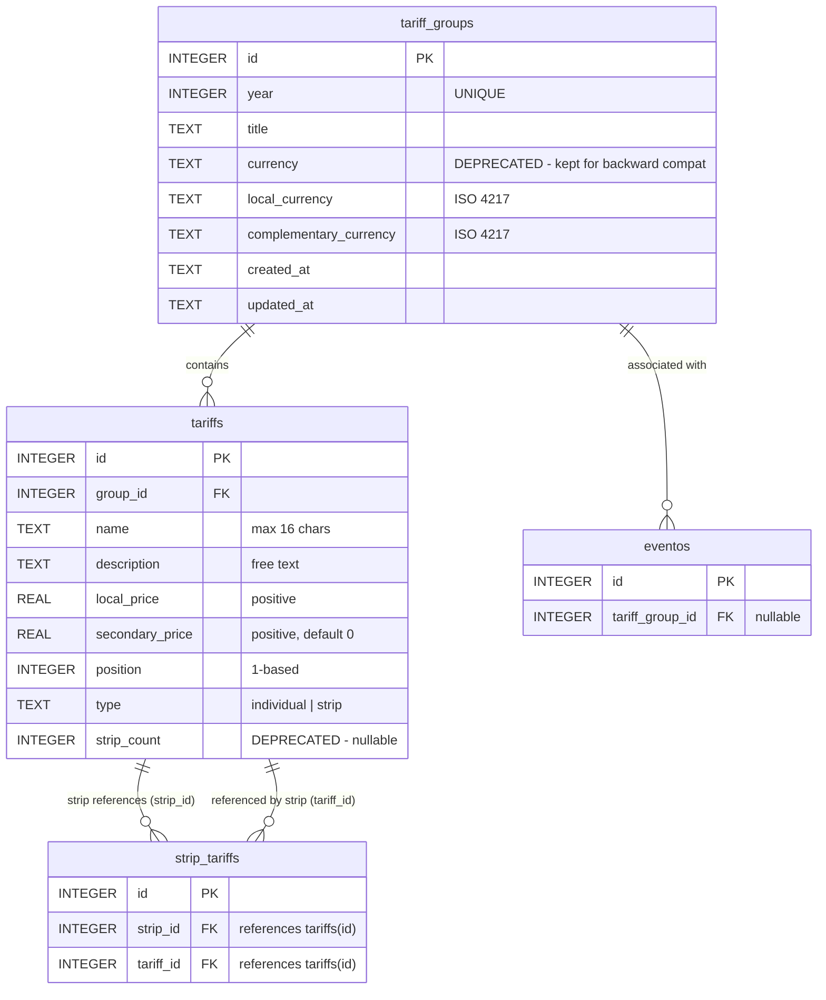

# Design Document: Tariff Groups Restructure

## Overview

This document describes the technical design for restructuring the tariff groups system. The current model uses a single `price` field per tariff, a `strip_count` integer for strips, and a single `currency` field on the group. The new model introduces:

1. **Dual-currency headers**: `local_currency` + `complementary_currency` on the group (replacing the single `currency` column).
2. **Richer tariff entities**: Each tariff gains a `description` field and dual pricing (`local_price` + `secondary_price`).
3. **Strips as composite references**: Strips no longer store a count—they reference specific tariffs via a junction table (`strip_tariffs`), and have their own name, description, and dual pricing.
4. **Referential integrity**: Renaming a tariff propagates to strip display; deleting a tariff cascades to the junction table and triggers validation warnings when a strip drops below 2 references.

The architecture follows the established pattern: SQLite → Repository → IPC Handlers → Preload Bridge → Zustand Store → React Components.

## Architecture

### System Architecture



### Data Flow: Create Tariff Group with Strips



### Referential Integrity: Tariff Deletion Flow



## Components and Interfaces

### TypeScript Types (Evolved)

```typescript
// ─── Tariff Types (restructured) ──────────────────────────────────────────────

export type TariffType = 'individual' | 'strip'

/** Individual tariff within a group */
export interface Tariff {
  id?: number
  name: string              // max 16 chars
  description: string       // free text description
  local_price: number       // positive, in local_currency
  secondary_price: number   // positive, in complementary_currency
  position: number          // 1-based order within group
  type: TariffType
}

/** Strip entity - references specific tariffs */
export interface Strip {
  id?: number
  name: string              // max 16 chars
  description: string       // free text description
  local_price: number       // positive, in local_currency
  secondary_price: number   // positive, in complementary_currency
  position: number          // 1-based order within strips
  type: 'strip'
  tariff_ids: number[]      // references to tariff IDs in same group (≥ 2)
}

/** Tariff group with dual-currency header */
export interface TariffGroup {
  id: number
  year: number
  title: string
  local_currency: string       // ISO 4217 (e.g., EUR)
  complementary_currency: string  // ISO 4217 (e.g., USD)
  tariffs: Tariff[]            // only type='individual'
  strips: Strip[]              // type='strip' with tariff_ids populated
  created_at: string
  updated_at: string
}

/** Input for creating a group */
export interface TariffGroupInput {
  year: number
  title: string
  local_currency: string
  complementary_currency: string
  tariffs: TariffInput[]
  strips: StripInput[]
}

/** Input for an individual tariff */
export interface TariffInput {
  name: string
  description: string
  local_price: number
  secondary_price: number
  position: number
}

/** Input for a strip */
export interface StripInput {
  name: string
  description: string
  local_price: number
  secondary_price: number
  position: number
  tariff_ids: number[]  // IDs or positions referencing tariffs within same group
}

/** Input for updating an existing group */
export interface TariffGroupUpdateInput {
  year?: number
  title?: string
  local_currency?: string
  complementary_currency?: string
  tariffs: TariffInput[]
  strips: StripInput[]
}
```

### Repository Interface

```typescript
export class TariffGroupsRepository {
  /** Validates input with dual-price, description, and strip-tariff rules */
  private validate(input: {
    title?: string
    local_currency?: string
    complementary_currency?: string
    tariffs: TariffInput[]
    strips: StripInput[]
  }): void

  /** Creates group + tariffs + strips + junction rows atomically */
  create(input: TariffGroupInput): TariffGroup

  /** Updates group, replaces tariffs/strips, re-creates junction rows */
  update(id: number, input: TariffGroupUpdateInput): TariffGroup | null

  /** Returns group with tariffs and strips (strips include tariff_ids) */
  getById(id: number): TariffGroup | null

  /** Returns all groups with tariffs and strips */
  getAll(): TariffGroup[]

  /** Returns groups for a given year */
  getByYear(year: number): TariffGroup[]

  /** Returns distinct years */
  getYears(): number[]

  /** Deletes group (fails if eventos reference it) */
  delete(id: number): { success: boolean; error?: string }
}
```

### IPC Channels (Updated)

The existing channels remain but their payload structure evolves:

| Channel | Params | Returns |
|---------|--------|---------|
| `tariff-groups:getYears` | none | `number[]` |
| `tariff-groups:getAll` | none | `TariffGroup[]` |
| `tariff-groups:getByYear` | `year: number` | `TariffGroup[]` |
| `tariff-groups:getById` | `id: number` | `TariffGroup \| null` |
| `tariff-groups:create` | `TariffGroupInput` | `TariffGroup` |
| `tariff-groups:update` | `id: number, TariffGroupUpdateInput` | `TariffGroup \| null` |
| `tariff-groups:delete` | `id: number` | `{ success: boolean; error?: string }` |

### UI Components

| Component | Location | Responsibility |
|-----------|----------|----------------|
| `TariffGroupSection` | `components/settings/TariffGroupSection.tsx` | Orchestrates list/create/edit modes |
| `TariffListPanel` | Inline within TariffGroupSection | Individual tariffs section (name, desc, local_price, secondary_price) |
| `StripListPanel` | Inline within TariffGroupSection | Strips section with multi-select tariff picker |
| `TariffMultiSelect` | `components/settings/TariffMultiSelect.tsx` | Checkbox-based multi-select for choosing tariffs in a strip |
| `CurrencySelector` | `components/settings/CurrencySelector.tsx` | Existing dropdown, used for both local and complementary currency |

### Form State (Client-Side)

```typescript
interface TariffFormRow {
  name: string
  description: string
  local_price: string
  secondary_price: string
}

interface StripFormRow {
  name: string
  description: string
  local_price: string
  secondary_price: string
  selected_tariff_indices: number[]  // indices into tariffs array
}

interface FormState {
  year: string
  title: string
  local_currency: string
  complementary_currency: string
  tariffs: TariffFormRow[]
  strips: StripFormRow[]
}
```

## Data Models

### Migration 007: Restructure Tariffs for Dual-Pricing and Strip References

```sql
-- Migration 007: Restructure tariffs for dual-pricing, descriptions, and strip-tariff junction

-- Step 1: Add description column to tariffs
ALTER TABLE tariffs ADD COLUMN description TEXT NOT NULL DEFAULT '';

-- Step 2: Rename price → local_price (SQLite doesn't support RENAME COLUMN in older versions,
-- so we use the table-rebuild approach)
-- Actually, SQLite 3.25+ supports ALTER TABLE RENAME COLUMN.
-- better-sqlite3 ships SQLite 3.40+, so this is safe.
ALTER TABLE tariffs RENAME COLUMN price TO local_price;

-- Step 3: Add secondary_price column
ALTER TABLE tariffs ADD COLUMN secondary_price REAL NOT NULL DEFAULT 0;

-- Step 4: Split currency into local_currency and complementary_currency
ALTER TABLE tariff_groups ADD COLUMN local_currency TEXT NOT NULL DEFAULT 'EUR';
ALTER TABLE tariff_groups ADD COLUMN complementary_currency TEXT NOT NULL DEFAULT 'EUR';

-- Migrate existing currency data to local_currency
UPDATE tariff_groups SET local_currency = currency WHERE currency IS NOT NULL AND currency != '';

-- Step 5: Create strip_tariffs junction table
CREATE TABLE IF NOT EXISTS strip_tariffs (
    id INTEGER PRIMARY KEY AUTOINCREMENT,
    strip_id INTEGER NOT NULL,
    tariff_id INTEGER NOT NULL,
    FOREIGN KEY (strip_id) REFERENCES tariffs(id) ON DELETE CASCADE,
    FOREIGN KEY (tariff_id) REFERENCES tariffs(id) ON DELETE CASCADE
);

CREATE INDEX IF NOT EXISTS idx_strip_tariffs_strip_id ON strip_tariffs(strip_id);
CREATE INDEX IF NOT EXISTS idx_strip_tariffs_tariff_id ON strip_tariffs(tariff_id);

-- Unique constraint: a strip can reference a tariff only once
CREATE UNIQUE INDEX IF NOT EXISTS idx_strip_tariffs_unique ON strip_tariffs(strip_id, tariff_id);

-- Step 6: Migrate existing strip data (strip_count → junction entries).
-- Existing strips had strip_count indicating how many tariffs they cover.
-- We'll link them to the first N individual tariffs in the same group by position.
-- This is a best-effort migration for existing strips.
INSERT INTO strip_tariffs (strip_id, tariff_id)
SELECT s.id AS strip_id, t.id AS tariff_id
FROM tariffs s
JOIN tariffs t ON t.group_id = s.group_id
  AND t.type = 'individual'
  AND t.position <= s.strip_count
WHERE s.type = 'strip'
  AND s.strip_count IS NOT NULL
  AND s.strip_count >= 2;
```

### Resulting Schema (Post-Migration)



### Data Preservation Strategy

| Old Column | New Column | Migration Rule |
|-----------|-----------|----------------|
| `tariffs.price` | `tariffs.local_price` | Direct rename via `ALTER TABLE RENAME COLUMN` |
| (none) | `tariffs.secondary_price` | Set to `0` for existing rows |
| (none) | `tariffs.description` | Set to `''` (empty string) for existing rows |
| `tariff_groups.currency` | `tariff_groups.local_currency` | Copy value from `currency` column |
| (none) | `tariff_groups.complementary_currency` | Default `'EUR'` |
| `tariffs.strip_count` | `strip_tariffs` rows | Best-effort: link to first N tariffs by position |


## Correctness Properties

*A property is a characteristic or behavior that should hold true across all valid executions of a system—essentially, a formal statement about what the system should do. Properties serve as the bridge between human-readable specifications and machine-verifiable correctness guarantees.*

### Property 1: TariffGroup data round-trip

*For any* valid TariffGroupInput with arbitrary year, title, local_currency, complementary_currency, and tariffs (each with name, description, local_price, secondary_price), creating the group and then retrieving it by ID SHALL return an object that preserves all header fields and all tariff field values exactly.

**Validates: Requirements 1.2, 1.3, 2.2, 6.1, 6.3**

### Property 2: Strip-tariff association round-trip

*For any* valid TariffGroupInput containing strips, where each strip references ≥ 2 tariffs by position, creating the group and then retrieving it by ID SHALL return strips with `tariff_ids` arrays that exactly match the set of referenced tariff IDs.

**Validates: Requirements 3.4, 6.2, 6.4**

### Property 3: Year uniqueness enforcement

*For any* year value, if a TariffGroup already exists for that year, attempting to create a new group for the same year SHALL be rejected with an error. Likewise, *for any* existing group, attempting to update its year to a value already used by another group SHALL be rejected.

**Validates: Requirements 1.6**

### Property 4: Name validation for tariffs and strips

*For any* tariff or strip with a name that is empty (or whitespace-only) or exceeds 16 characters, the validation SHALL reject it. *For any* name of 1–16 non-whitespace-only characters, the name validation SHALL pass.

**Validates: Requirements 2.3, 2.4, 3.5, 3.6**

### Property 5: Price validation for all price fields

*For any* tariff or strip with a `local_price` or `secondary_price` that is ≤ 0, NaN, or non-finite, the validation SHALL reject it. *For any* positive finite number as price, the validation SHALL pass.

**Validates: Requirements 2.5, 2.6, 3.7, 3.8**

### Property 6: Individual tariff cardinality bounds

*For any* TariffGroupInput with fewer than 2 individual tariffs, the validation SHALL reject the input. *For any* input with more than 20 individual tariffs, the validation SHALL reject the input. *For any* count in [2, 20] with valid fields, the cardinality validation SHALL pass.

**Validates: Requirements 2.7, 2.8**

### Property 7: Strip minimum tariff selection

*For any* strip with fewer than 2 entries in its `tariff_ids` (or `selected_tariff_indices`), the validation SHALL reject it. *For any* strip referencing ≥ 2 valid tariffs within the same group, the selection validation SHALL pass.

**Validates: Requirements 3.3, 3.9, 4.3, 4.4**

### Property 8: CASCADE deletion of strip-tariff references

*For any* tariff that is referenced by one or more strips via the `strip_tariffs` junction table, deleting that tariff SHALL remove all corresponding rows from `strip_tariffs`. After deletion, no junction row SHALL reference the deleted tariff ID.

**Validates: Requirements 4.2, 5.6, 6.5**

### Property 9: Year field validation

*For any* non-integer value (empty string, float, non-numeric string), the year validation SHALL reject it. *For any* valid integer, the year validation SHALL pass.

**Validates: Requirements 1.4**

### Property 10: Strip tariff picker reflects current tariff list

*For any* form state with N individual tariffs, the derived options available in each strip's tariff picker SHALL contain exactly those N tariffs. When a tariff is added or removed from the form, the picker options SHALL immediately reflect the change.

**Validates: Requirements 3.2, 7.2, 7.3**

## Error Handling

### Error Strategy by Layer

| Layer | Error Type | Handling |
|-------|-----------|----------|
| Migration | SQL syntax / constraint | Transaction auto-reverts, error logged |
| Repository | UNIQUE constraint (year) | Catch SQLite error, throw descriptive message |
| Repository | Validation failure | Throw with descriptive field-specific message |
| IPC Handler | Any exception | `handleIpc` wrapper catches and re-throws clean message |
| Store | IPC error | Store in `state.error`, expose to component |
| Component | Frontend validation | Prevent submit, show inline translated messages (i18n) |

### Dual Validation (Frontend + Backend)

Validation executes at two layers:

1. **Frontend (before sending)**: Reactive validation in the form:
   - Year: non-empty valid integer
   - Title: non-empty
   - Local/complementary currency: non-empty
   - Tariff name: 1–16 characters
   - Tariff/strip local_price: > 0
   - Tariff/strip secondary_price: > 0
   - Individual tariff count: [2, 20]
   - Strip tariff selection: ≥ 2 per strip
   - Strip with < 2 tariffs after deletion: warning shown, save disabled

2. **Backend (before persisting)**: The repository validates the same rules, rejecting with descriptive errors. Protects against direct IPC calls.

### Error Constants (Updated)

```typescript
export const TARIFF_GROUP_ERRORS = {
  DUPLICATE_YEAR: 'Ya existe un grupo para ese año',
  MIN_INDIVIDUAL_TARIFFS: 'Se requieren al menos 2 tarifas individuales',
  MAX_INDIVIDUAL_TARIFFS: 'El máximo permitido es 20 tarifas individuales',
  STRIP_MIN_TARIFFS: 'Una tira debe referenciar al menos 2 tarifas individuales',
  EMPTY_TITLE: 'El título es obligatorio',
  EMPTY_CURRENCY: 'El tipo de moneda es obligatorio',
  EMPTY_TARIFF_NAME: 'El nombre de la tarifa es obligatorio',
  TARIFF_NAME_TOO_LONG: 'El nombre no puede exceder 16 caracteres',
  INVALID_LOCAL_PRICE: 'El precio local debe ser un número positivo',
  INVALID_SECONDARY_PRICE: 'El precio complementario debe ser un número positivo',
  GROUP_IN_USE: 'No se puede eliminar: el grupo está asociado a eventos',
  NOT_FOUND: 'Grupo de tarifas no encontrado',
} as const
```

## Testing Strategy

### Dual Testing Approach: Unit Tests + Property Tests

This feature involves business logic (validation, data transformation, referential integrity) that is well-suited for property-based testing. The input space is large (arbitrary strings, numbers, tariff counts, strip selections) and universal properties hold across all valid inputs.

#### Property-Based Testing Library

**fast-check** (already installed as dev dependency, v4.8.0) with Vitest. Each property test runs a minimum of **100 iterations**.

Each test is tagged with a comment referencing the design property:
```typescript
// Feature: tariff-groups-restructure, Property {N}: {title}
```

#### Property Tests to Implement

| # | Property | Test File |
|---|----------|-----------|
| 1 | TariffGroup data round-trip | `src/main/database/__tests__/tariff-groups-restructure.property.test.ts` |
| 2 | Strip-tariff association round-trip | `src/main/database/__tests__/tariff-groups-restructure.property.test.ts` |
| 3 | Year uniqueness enforcement | `src/main/database/__tests__/tariff-groups-restructure.property.test.ts` |
| 4 | Name validation | `src/main/database/__tests__/tariff-groups-restructure.property.test.ts` |
| 5 | Price validation | `src/main/database/__tests__/tariff-groups-restructure.property.test.ts` |
| 6 | Individual tariff cardinality bounds | `src/main/database/__tests__/tariff-groups-restructure.property.test.ts` |
| 7 | Strip minimum tariff selection | `src/main/database/__tests__/tariff-groups-restructure.property.test.ts` |
| 8 | CASCADE deletion | `src/main/database/__tests__/tariff-groups-restructure.property.test.ts` |
| 9 | Year field validation | `src/main/database/__tests__/tariff-groups-restructure.property.test.ts` |
| 10 | Strip tariff picker reflects tariff list | `src/renderer/src/__tests__/strip-picker-options.property.test.ts` |

#### Unit Tests (Example-Based)

- Migration 007 applies successfully on top of 006
- Existing data preserved: price → local_price, secondary_price = 0
- Strip_count data migrated to junction table rows
- UI: TariffGroupSection renders separate tariff and strip sections
- UI: Multi-select picker shows correct tariff options
- UI: Currency labels display correct symbols
- IPC integration: create/update/read with new field structure
- Deletion blocked when group is referenced by eventos

#### Test File Structure

```
src/main/database/__tests__/tariff-groups-restructure.property.test.ts  # PBT properties 1-9
src/renderer/src/__tests__/strip-picker-options.property.test.ts        # PBT property 10
src/main/database/__tests__/migration-007.test.ts                       # Unit: migration
src/main/ipc/__tests__/tariff-groups-restructure.integration.test.ts    # Integration: IPC
```

### Design Decisions and Rationale

| Decision | Rationale |
|----------|-----------|
| Junction table `strip_tariffs` instead of `strip_count` integer | Enables true many-to-many references; supports specific tariff selection rather than just a count |
| Keep `currency` column (deprecated) alongside new columns | Backward compatibility during migration; can be dropped in a future migration |
| Separate `tariffs` array and `strips` array in TariffGroup response | Cleaner API; consumers don't need to filter by type |
| Strips stored in same `tariffs` table with type='strip' | Keeps the schema simple; avoids a separate table for strips which share most columns |
| Client-side referential integrity (tariff removal updates strips) | Instant feedback without server round-trip; backend validates on save |
| `ALTER TABLE RENAME COLUMN` for price→local_price | Supported in SQLite 3.25+ (better-sqlite3 ships 3.40+); preserves data without table rebuild |
| Best-effort migration of strip_count → junction rows | Links strips to first N tariffs by position; not perfect but preserves relationships |
| fast-check for PBT | Already a project dependency; integrates with Vitest |
