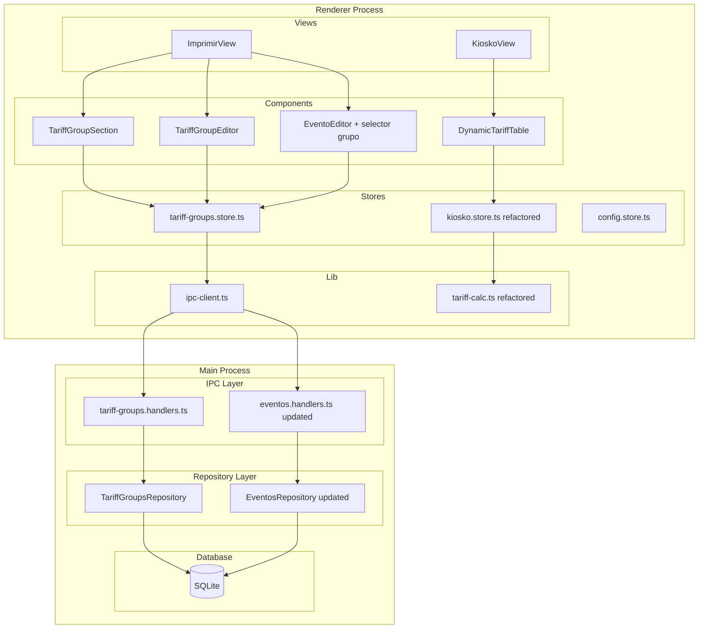
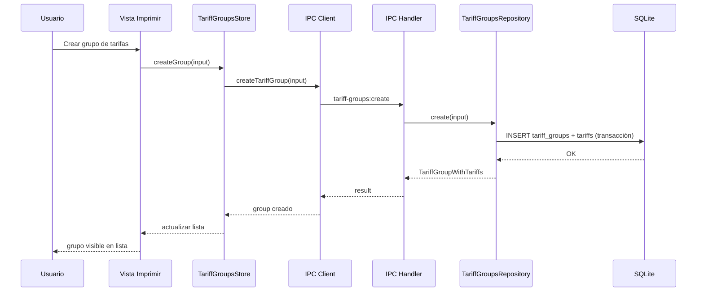
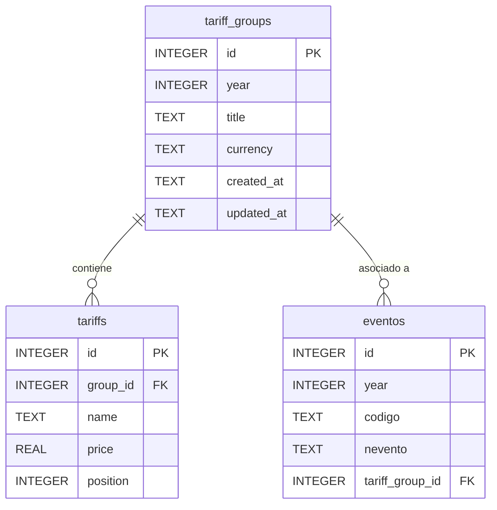

# Documento de Diseño: Grupos de Tarifas

## Resumen

Este documento describe el diseño técnico para el sistema de grupos de tarifas dinámicos. El objetivo es reemplazar las 6 tarifas fijas actuales (A, A2, B, C, Tira A, Tira 4) por grupos configurables de 2 a 10 tarifas que se almacenan en SQLite, se asocian a eventos y se renderizan dinámicamente en la vista kiosko.

El diseño sigue la arquitectura existente de capas: SQLite → Repository → IPC Handlers → Preload Bridge → IPC Client → Zustand Store → React Components.

## Arquitectura

### Diagrama de Arquitectura General



### Diagrama de Flujo de Datos



## Componentes e Interfaces

### Tipos TypeScript Compartidos

```typescript
// ─── Tariff Group Types ───────────────────────────────────────────────────────

/** Tarifa individual dentro de un grupo */
export interface Tariff {
  id?: number
  name: string        // máximo 16 caracteres
  price: number       // positivo
  position: number    // orden dentro del grupo (1-based)
}

/** Grupo de tarifas completo con sus tarifas */
export interface TariffGroup {
  id: number
  year: number
  title: string
  currency: string    // tipo de moneda (ej: "EUR", "USD")
  tariffs: Tariff[]
  created_at: string
  updated_at: string
}

/** Input para crear un grupo de tarifas */
export interface TariffGroupInput {
  year: number
  title: string
  currency: string
  tariffs: TariffInput[]
}

/** Input para una tarifa individual */
export interface TariffInput {
  name: string
  price: number
  position: number
}

/** Input para actualizar un grupo (parcial en grupo, completo en tarifas) */
export interface TariffGroupUpdateInput {
  year?: number
  title?: string
  currency?: string
  tariffs: TariffInput[]  // siempre se envía la lista completa de tarifas
}
```

### Repository: TariffGroupsRepository

```typescript
export class TariffGroupsRepository {
  constructor(db?: Database.Database)

  /** Obtener todos los años con grupos, descendente */
  getYears(): number[]

  /** Obtener todos los grupos (con tarifas) */
  getAll(): TariffGroup[]

  /** Obtener grupos de un año (con tarifas) */
  getByYear(year: number): TariffGroup[]

  /** Obtener un grupo por ID (con tarifas) */
  getById(id: number): TariffGroup | null

  /** Crear grupo + tarifas atómicamente */
  create(input: TariffGroupInput): TariffGroup

  /** Actualizar grupo + sincronizar tarifas atómicamente */
  update(id: number, input: TariffGroupUpdateInput): TariffGroup | null

  /** Eliminar grupo (con cascade de tarifas). Falla si hay eventos asociados. */
  delete(id: number): { success: boolean; error?: string }

  /** Obtener IDs de eventos que usan un grupo */
  getEventsByGroupId(groupId: number): number[]
}
```

### IPC Handlers: tariff-groups.handlers.ts

```typescript
export function registerTariffGroupsHandlers(): void {
  // tariff-groups:getYears → number[]
  // tariff-groups:getAll → TariffGroup[]
  // tariff-groups:getByYear → TariffGroup[]
  // tariff-groups:getById → TariffGroup | null
  // tariff-groups:create → TariffGroup
  // tariff-groups:update → TariffGroup | null
  // tariff-groups:delete → { success: boolean; error?: string }
}
```

### Preload Bridge: Extensión de ElectronAPI

```typescript
// Nuevo namespace en ElectronAPI
tariffGroups: {
  getYears(): Promise<number[]>
  getAll(): Promise<TariffGroup[]>
  getByYear(year: number): Promise<TariffGroup[]>
  getById(id: number): Promise<TariffGroup | null>
  create(input: TariffGroupInput): Promise<TariffGroup>
  update(id: number, input: TariffGroupUpdateInput): Promise<TariffGroup | null>
  delete(id: number): Promise<{ success: boolean; error?: string }>
}
```

### IPC Client: Funciones exportadas

```typescript
// Nuevas funciones en ipc-client.ts
export async function getTariffGroupYears(): Promise<number[]>
export async function getAllTariffGroups(): Promise<TariffGroup[]>
export async function getTariffGroupsByYear(year: number): Promise<TariffGroup[]>
export async function getTariffGroupById(id: number): Promise<TariffGroup | null>
export async function createTariffGroup(input: TariffGroupInput): Promise<TariffGroup>
export async function updateTariffGroup(id: number, input: TariffGroupUpdateInput): Promise<TariffGroup | null>
export async function deleteTariffGroup(id: number): Promise<{ success: boolean; error?: string }>
```

### Zustand Store: tariff-groups.store.ts

```typescript
export interface TariffGroupsState {
  groups: TariffGroup[]
  years: number[]
  selectedYear: number | null
  selectedGroup: TariffGroup | null
  loading: boolean
  error: string | null

  // Actions
  loadYears(): Promise<void>
  loadByYear(year: number): Promise<void>
  loadAll(): Promise<void>
  selectGroup(group: TariffGroup | null): void
  createGroup(input: TariffGroupInput): Promise<TariffGroup>
  updateGroup(id: number, input: TariffGroupUpdateInput): Promise<TariffGroup | null>
  deleteGroup(id: number): Promise<{ success: boolean; error?: string }>
}
```

### Refactorización del KioskoStore

El store actual usa `KioskoQuantities` con campos fijos. El nuevo diseño usa un mapa dinámico:

```typescript
/** Cantidades dinámicas: clave = `tariff_${tariffId}_s${model}` */
export type DynamicQuantities = Record<string, number>

export interface KioskoState {
  quantities: DynamicQuantities
  activeTariffGroup: TariffGroup | null

  // Derivados
  getTotal(): number
  getLimits(): DynamicLimits
  getUsedRollo1(): number
  getUsedRollo2(): number

  // Acciones
  setQuantity(tariffId: number, model: 1 | 2, value: number): void
  reset(): void
  setActiveTariffGroup(group: TariffGroup | null): void
}
```

### Componentes React

| Componente | Ubicación | Responsabilidad |
|---|---|---|
| `TariffGroupSection` | `components/imprimir/` | Lista de grupos por año con selector |
| `TariffGroupEditor` | `components/imprimir/` | Formulario crear/editar grupo + tarifas |
| `DynamicTariffTable` | `components/kiosko/` | Reemplaza `TariffTableSplit` con filas dinámicas |
| `DynamicTariffRow` | `components/kiosko/` | Fila individual de tarifa dinámica |

## Modelos de Datos

### Migración SQL: 005_tariff_groups.sql

```sql
-- Migration 005: Create tariff_groups and tariffs tables

CREATE TABLE IF NOT EXISTS tariff_groups (
    id INTEGER PRIMARY KEY AUTOINCREMENT,
    year INTEGER NOT NULL,
    title TEXT NOT NULL,
    currency TEXT NOT NULL DEFAULT 'EUR',
    created_at TEXT DEFAULT (datetime('now')),
    updated_at TEXT DEFAULT (datetime('now'))
);

-- Unicidad de año + título
CREATE UNIQUE INDEX IF NOT EXISTS idx_tariff_groups_year_title
    ON tariff_groups(year, title);

-- Índice para búsquedas por año
CREATE INDEX IF NOT EXISTS idx_tariff_groups_year
    ON tariff_groups(year);

CREATE TABLE IF NOT EXISTS tariffs (
    id INTEGER PRIMARY KEY AUTOINCREMENT,
    group_id INTEGER NOT NULL,
    name TEXT NOT NULL,
    price REAL NOT NULL,
    position INTEGER NOT NULL DEFAULT 1,
    FOREIGN KEY (group_id) REFERENCES tariff_groups(id) ON DELETE CASCADE
);

-- Índice para obtener tarifas de un grupo rápidamente
CREATE INDEX IF NOT EXISTS idx_tariffs_group_id
    ON tariffs(group_id);

-- Añadir columna tariff_group_id a eventos (nullable para compatibilidad)
ALTER TABLE eventos ADD COLUMN tariff_group_id INTEGER REFERENCES tariff_groups(id);
```

### Diagrama Entidad-Relación



## Propiedades de Corrección

*Una propiedad es una característica o comportamiento que debe mantenerse verdadero en todas las ejecuciones válidas de un sistema—esencialmente, una declaración formal sobre lo que el sistema debe hacer. Las propiedades sirven como puente entre especificaciones legibles por humanos y garantías de corrección verificables por máquina.*

### Propiedad 1: Round-trip de persistencia (crear y recuperar)

*Para cualquier* entrada válida de TariffGroupInput (año, título, moneda, y entre 2 y 10 tarifas con nombres de 1-16 caracteres y precios positivos), crear el grupo y luego recuperarlo por ID debe devolver un objeto con los mismos valores de año, título, moneda, y exactamente las mismas tarifas (nombre, precio, posición).

**Validates: Requirements 1.1, 1.2, 2.2**

### Propiedad 2: Round-trip de actualización

*Para cualquier* grupo de tarifas existente y cualquier conjunto válido de cambios (nuevo título, nuevo año, nueva moneda, tarifas añadidas/eliminadas/modificadas dentro de los límites 2-10), aplicar la actualización y luego recuperar el grupo por ID debe reflejar exactamente los cambios solicitados.

**Validates: Requirements 3.2**

### Propiedad 3: Eliminación en cascada

*Para cualquier* grupo de tarifas creado con N tarifas (2 ≤ N ≤ 10), al eliminar el grupo, consultar las tarifas por group_id debe devolver un conjunto vacío.

**Validates: Requirements 1.3, 4.2**

### Propiedad 4: Unicidad de año + título

*Para cualquier* par (año, título), si ya existe un grupo con esa combinación, intentar crear otro grupo con el mismo año y título debe fallar con un error descriptivo, y intentar actualizar otro grupo existente para que tenga ese mismo año y título también debe fallar.

**Validates: Requirements 1.4, 2.3, 3.5**

### Propiedad 5: Validación de cardinalidad de tarifas

*Para cualquier* entrada de grupo con menos de 2 tarifas o más de 10 tarifas, la operación de validación debe rechazar la entrada indicando el límite violado. Para cualquier entrada con entre 2 y 10 tarifas válidas, la validación de cardinalidad debe pasar.

**Validates: Requirements 2.4, 2.5, 3.3, 3.4**

### Propiedad 6: Validación de tarifas individuales

*Para cualquier* tarifa individual: si el nombre tiene más de 16 caracteres, o está vacío, o el precio es ≤ 0, o el precio no es numérico, la validación debe rechazar la entrada con un mensaje descriptivo. Estas validaciones deben ser consistentes entre frontend y backend.

**Validates: Requirements 5.1, 5.2, 5.3, 5.4, 5.5**

### Propiedad 7: Integridad referencial en eliminación

*Para cualquier* grupo de tarifas que está referenciado por al menos un evento (vía tariff_group_id), intentar eliminar ese grupo debe fallar con un error que identifique los eventos que lo usan.

**Validates: Requirements 4.3**

### Propiedad 8: Asociación evento-grupo round-trip

*Para cualquier* evento y cualquier grupo de tarifas válido, al guardar el evento con una referencia al grupo y luego recuperar el evento, el campo tariff_group_id debe contener el ID del grupo asociado.

**Validates: Requirements 6.4, 6.5**

### Propiedad 9: Invariante de ordenamiento de tarifas

*Para cualquier* grupo de tarifas recuperado (ya sea por getById, getByYear o getAll), las tarifas del grupo deben estar ordenadas por su campo `position` de forma ascendente.

**Validates: Requirements 7.3, 9.3**

### Propiedad 10: Corrección de consulta por año

*Para cualquier* conjunto de grupos creados en distintos años, la función getYears() debe devolver los años en orden descendente, y getByYear(year) debe devolver exactamente los grupos que pertenecen a ese año (ni más ni menos).

**Validates: Requirements 9.1, 9.2**

### Propiedad 11: Cálculo de total con tarifas dinámicas

*Para cualquier* grupo de tarifas con N tarifas y cualquier conjunto de cantidades no negativas, el total calculado debe ser exactamente la suma de (cantidad × precio) para cada tarifa en ambos modelos de sello.

**Validates: Requirements 7.1, 7.2**

## Manejo de Errores

### Estrategia de Errores por Capa

| Capa | Tipo de Error | Manejo |
|---|---|---|
| Repository | Violación UNIQUE | Capturar error SQLite, devolver mensaje descriptivo |
| Repository | FK constraint (delete) | Consultar eventos asociados antes de eliminar, devolver lista |
| IPC Handler | Cualquier excepción | `handleIpc` wrapper captura y re-lanza con mensaje limpio |
| Store | Error de IPC | Almacenar en `state.error`, exponer al componente |
| Componente | Validación frontend | Impedir envío, mostrar mensajes inline |

### Validación Dual (Frontend + Backend)

La validación se ejecuta en dos puntos:

1. **Frontend (antes de enviar)**: La función `validateTariffGroupInput()` en el renderer valida:
   - Título no vacío
   - Moneda no vacía
   - Número de tarifas entre 2 y 10
   - Cada nombre de tarifa: 1-16 caracteres
   - Cada precio: numérico y > 0

2. **Backend (antes de persistir)**: El repository valida las mismas reglas y rechaza con errores descriptivos. Esto protege contra llamadas directas al IPC que bypaseen la UI.

### Códigos de Error

```typescript
export const TARIFF_GROUP_ERRORS = {
  DUPLICATE_YEAR_TITLE: 'Ya existe un grupo con ese año y título',
  MIN_TARIFFS: 'Se requieren al menos 2 tarifas',
  MAX_TARIFFS: 'El máximo permitido es 10 tarifas',
  EMPTY_TITLE: 'El título es obligatorio',
  EMPTY_CURRENCY: 'El tipo de moneda es obligatorio',
  EMPTY_TARIFF_NAME: 'El nombre de la tarifa es obligatorio',
  TARIFF_NAME_TOO_LONG: 'El nombre no puede exceder 16 caracteres',
  INVALID_PRICE: 'El precio debe ser un número positivo',
  GROUP_IN_USE: 'No se puede eliminar: el grupo está asociado a eventos',
  NOT_FOUND: 'Grupo de tarifas no encontrado'
} as const
```

## Estrategia de Testing

### Testing Dual: Unit Tests + Property Tests

#### Property-Based Tests (PBT)

Se utilizará **fast-check** como librería de property-based testing (ya disponible o fácil de añadir al proyecto TypeScript/Vitest).

Configuración: mínimo **100 iteraciones** por propiedad.

Cada test de propiedad referenciará su propiedad del documento de diseño:

```typescript
// Tag: Feature: tariff-groups, Property 1: Round-trip de persistencia
```

**Tests de propiedad a implementar:**

1. **Repository round-trip create** — Genera inputs válidos aleatorios, crea, recupera, verifica igualdad.
2. **Repository round-trip update** — Genera ediciones válidas aleatorias, aplica, recupera, verifica.
3. **Cascade deletion** — Genera grupos con N tarifas, elimina, verifica que no quedan tarifas huérfanas.
4. **Uniqueness constraint** — Genera pares (año, título), verifica que duplicados son rechazados.
5. **Cardinality validation** — Genera números de tarifas fuera de rango [2,10], verifica rechazo.
6. **Individual tariff validation** — Genera nombres/precios inválidos, verifica rechazo con mensaje correcto.
7. **Referential integrity** — Genera grupos asociados a eventos, verifica que delete falla.
8. **Event-group association** — Genera asociaciones evento-grupo, verifica persistencia.
9. **Ordering invariant** — Genera grupos con posiciones aleatorias, verifica que la recuperación devuelve tarifas ordenadas por posición.
10. **Year query correctness** — Genera grupos en múltiples años, verifica orden descendente y filtrado correcto.
11. **Dynamic total calculation** — Genera tarifas con precios y cantidades aleatorias, verifica que total = Σ(qty × price).

#### Unit Tests (Ejemplos Específicos)

- Renderizado del formulario de creación con campos correctos
- Pre-población del formulario en modo edición
- Diálogo de confirmación antes de eliminar
- Selector de grupo en EventoEditor
- Mensaje "sin tarifas configuradas" cuando evento no tiene grupo
- Visualización de moneda junto a precios
- Integración IPC end-to-end (1-2 ejemplos por canal)

#### Estructura de Archivos de Tests

```
src/main/database/__tests__/tariff-groups.repository.test.ts      # PBT + unit
src/main/database/__tests__/tariff-groups.repository.property.test.ts  # PBT puro
src/main/ipc/__tests__/tariff-groups.handlers.test.ts             # Integration
src/renderer/src/lib/__tests__/tariff-calc.dynamic.property.test.ts  # PBT cálculos
```

### Decisiones de Diseño y Justificaciones

| Decisión | Justificación |
|---|---|
| Dos tablas (tariff_groups + tariffs) en lugar de JSON blob | Permite queries SQL directas, índices, y constraints a nivel de BD |
| ON DELETE CASCADE en FK | Garantiza integridad sin lógica adicional en código |
| `tariffs` siempre se envía completo en updates | Simplifica la sincronización: delete all + re-insert en transacción |
| `tariff_group_id` nullable en eventos | Compatibilidad con eventos existentes sin grupo asignado |
| Mapa dinámico de cantidades en KioskoStore | Soporta N tarifas arbitrarias sin recompilar tipos |
| Validación dual (frontend + backend) | Defensa en profundidad: UX rápida + integridad garantizada |
| fast-check para PBT | Librería madura, integración nativa con Vitest, buena documentación |
